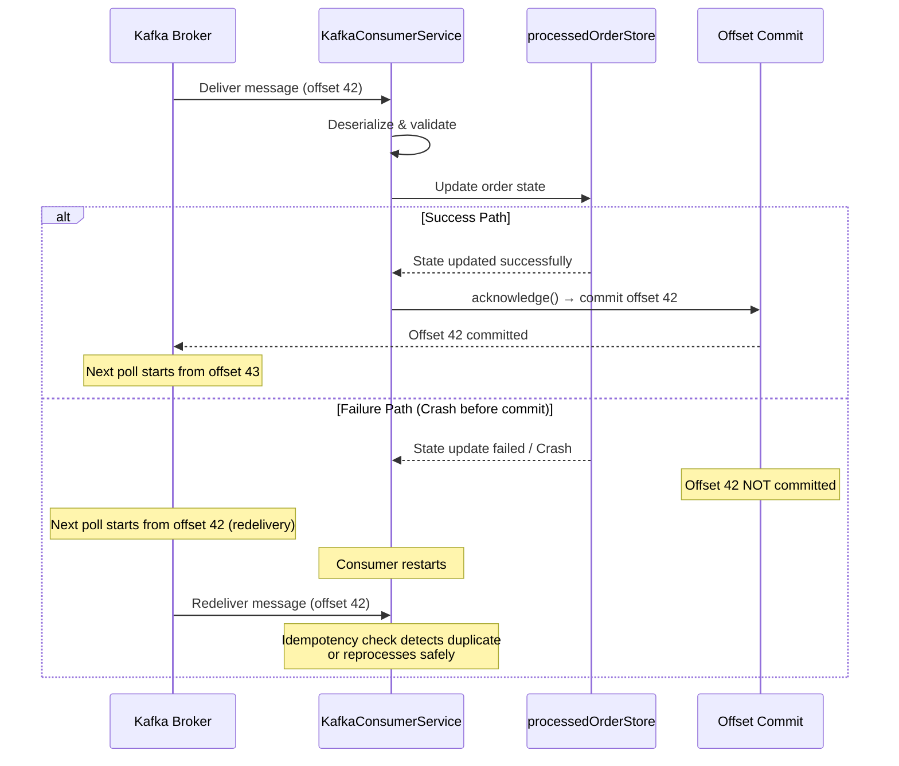

# CONFIG.md: Consumer Configuration

This document explains all configuration options available for the **Order Service (Consumer)** and the rationale behind each choice.

**Course Context**: These configurations implement **Session 6 - Consumer Patterns** and **Session 7 - Offset Management** from the MTA Event-Driven Architecture course, focusing on manual offset commits and At-Least-Once delivery semantics.

---

## Overview

The consumer is configured through multiple layers:
1. **Default Values** in `application.properties`
2. **Environment Variables** (Docker Compose)
3. **Command-Line Overrides** (runtime)

Configuration values follow the precedence: **Command-line → Environment Variables → application.properties defaults**

---

## Spring Boot Configuration (application.properties)

### Server Configuration

#### `server.port=8082`
- **Purpose**: HTTP port for the consumer service
- **Default**: `8082`
- **Why This Value**: Avoids conflict with producer (8081) and common ports
- **Override**: `SERVER_PORT=8083 docker-compose up -d`

#### `spring.application.name=order-service`
- **Purpose**: Internal application identifier
- **Default**: `order-service`
- **Why This Value**: Clearly identifies the service in logs and monitoring
- **Used By**: Spring Boot actuators, metrics, and health endpoints

---

## Kafka Configuration

### Bootstrap Servers

#### `spring.kafka.bootstrap-servers=kafka:29092`
- **Purpose**: Address(es) of Kafka brokers
- **Default**: `kafka:29092`
- **Why This Value**: 
  - Docker hostname resolution (internal container name)
  - Port 29092 is the internal protocol port (not exposed externally)
  - Configured by producer's docker-compose
- **Override**: `SPRING_KAFKA_BOOTSTRAP_SERVERS=kafka-external:9092`
- **Typical Values**:
  - Docker: `kafka:29092`
  - Local Dev: `localhost:9092`
  - Remote: `kafka-broker-1.example.com:9092,kafka-broker-2.example.com:9092`

### Consumer Group Configuration

#### `spring.kafka.consumer.group-id=order-service-group`
- **Purpose**: Kafka consumer group identifier
- **Default**: `order-service-group`
- **Why This Value**: 
  - Unique identifier for this consumer's group
  - Multiple instances with same group-id share partitions
  - Named clearly to indicate it processes orders
- **Behavior**: All messages are replayed if this group is new or offset is reset
- **Multiple Instances**: If you run 2+ consumer instances with same group-id, Kafka automatically distributes partitions

#### `spring.kafka.consumer.group-id=${SPRING_KAFKA_CONSUMER_GROUP_ID}`
- **Alternative Override**: Via environment variable
- **Example**: `SPRING_KAFKA_CONSUMER_GROUP_ID=order-service-group-v2`

### Offset Management (Critical for At-Least-Once)

#### `spring.kafka.consumer.auto-offset-reset=earliest`
- **Purpose**: How to handle missing/invalid offsets
- **Default**: `earliest`
- **Possible Values**:
  - `earliest`: Start from the beginning of the topic (reprocess all messages)
  - `latest`: Start from the end (skip historical messages)
  - `none`: Throw error if offset is missing
- **Why `earliest`**: 
  - Ensures no events are lost on first startup
  - Aligns with "At-Least-Once" delivery semantics
  - Safe default (can reprocess, not skip)
  - **Course Requirement**: Guarantees all order events are eventually processed
- **When to Change**:
  - Change to `latest` if you only want new messages (but will lose historical state)
  - Use `none` if you explicitly manage offsets externally

#### `spring.kafka.consumer.enable-auto-commit=false`
- **Purpose**: Automatic vs. manual offset commits
- **Default**: `false` (MANDATORY for this course)
- **Why `false`**:
  - **Critical for At-Least-Once**: Manual control over when to commit
  - Consumer only commits offset AFTER state is successfully persisted
  - If consumer crashes before commit, message is redelivered on restart
  - Prevents losing events due to early commits
  - **Course Requirement (Session 7)**: Demonstrates understanding of offset management
- **Do NOT Change**: This is a course requirement for reliability

**At-Least-Once Delivery Flow:**



**Why This Matters:**
- **Auto-commit enabled** (bad): Offsets committed before processing → message loss on crash
- **Auto-commit disabled** (good): Offsets committed after processing → guaranteed delivery

---

## Manual Acknowledgment (At-Least-Once Delivery)

### Container Factory Configuration (KafkaConsumerConfig.java)

#### `AckMode.MANUAL_IMMEDIATE`
- **Purpose**: When to commit offsets
- **Options**:
  - `MANUAL`: Commit only when `acknowledgment.acknowledge()` is called
  - `MANUAL_IMMEDIATE`: Commit after `acknowledge()` call returns (immediate)
  - `AUTO`: Automatic commit (NOT ALLOWED for this course)
  - `BATCH`: Commit when batch is complete
  - `RECORD`: Commit after each record
- **Why `MANUAL_IMMEDIATE`**:
  - Precise control: commit happens immediately after state update
  - Synchronous: easier to reason about failure scenarios
  - Safer than `MANUAL` which could lose commits on crash
  - **Course Requirement (Session 7)**: Demonstrates "commit after processing" pattern
- **Flow**:
  ```
  Message received → Deserialize → Process → State updated → acknowledge() → Offset committed
  ```

**Configuration in Code:**

```java
@Bean
public ConcurrentKafkaListenerContainerFactory<String, String> kafkaListenerContainerFactory(
        ConsumerFactory<String, String> consumerFactory) {
    
    ConcurrentKafkaListenerContainerFactory<String, String> factory = 
        new ConcurrentKafkaListenerContainerFactory<>();
    
    factory.setConsumerFactory(consumerFactory);
    factory.getContainerProperties().setAckMode(ContainerProperties.AckMode.MANUAL_IMMEDIATE);
    
    // UPDATED: Enable auto-startup for immediate consumption
    // Spring manages the lifecycle, while KafkaConnectivityService monitors health
    factory.setAutoStartup(true);
    
    return factory;
}
```

**Comparison of Acknowledgment Modes:**

| Mode | When Committed | Use Case | Risk |
|------|---------------|----------|------|
| **AUTO** | After poll interval | High throughput, can tolerate message loss | Message loss on crash |
| **RECORD** | After each message | Low latency, minimal redelivery | Higher commit overhead |
| **BATCH** | After batch complete | Balance throughput & safety | Entire batch redelivered on crash |
| **MANUAL** | Explicit acknowledge() call | Full control, batching possible | Must manage commits carefully |
| **MANUAL_IMMEDIATE** | After acknowledge() returns | Full control + immediate commit | Slight overhead per message |

**Our Choice: MANUAL_IMMEDIATE**
- ✅ Guarantees offset committed after state persisted
- ✅ Synchronous behavior (predictable)
- ✅ Idempotency handles redeliveries gracefully
- ✅ Aligns with course requirement for manual offset management

---

## Topic Configuration and Partition Strategy Interaction

### Consumer-Side Topic Configuration

#### `kafka.consumer.topic=${KAFKA_TOPIC:orders}`
- **Purpose**: Which Kafka topic the consumer listens to
- **Default**: `orders`
- **Why `orders`**: Standard topic name matching producer
- **Must Match Producer**: Producer publishes to `order-events`, consumer reads from same topic
- **Override Priority**:
  1. Command-line: `KAFKA_TOPIC=my-topic docker-compose up -d`
  2. .env file: `KAFKA_TOPIC=my-topic`
  3. Default: `orders`

### Partition Strategy and Consumer Scalability

**How Partitions Affect Consumption:**

```
Topic: order-events (3 partitions)
Consumer Group: order-service-group

Scenario 1: Single Consumer Instance
┌─────────────────────┐
│   Consumer 1        │
│   Reads: P0, P1, P2 │  ← Sequential processing
└─────────────────────┘
Throughput: 1x (baseline)

Scenario 2: Three Consumer Instances (Optimal)
┌──────────────┐  ┌──────────────┐  ┌──────────────┐
│ Consumer 1   │  │ Consumer 2   │  │ Consumer 3   │
│ Reads: P0    │  │ Reads: P1    │  │ Reads: P2    │
└──────────────┘  └──────────────┘  └──────────────┘
Throughput: 3x (parallel processing)

Scenario 3: Five Consumer Instances (Over-provisioned)
┌──────────────┐  ┌──────────────┐  ┌──────────────┐  ┌──────────┐  ┌──────────┐
│ Consumer 1   │  │ Consumer 2   │  │ Consumer 3   │  │ Consumer │  │ Consumer │
│ Reads: P0    │  │ Reads: P1    │  │ Reads: P2    │  │    4     │  │    5     │
└──────────────┘  └──────────────┘  └──────────────┘  │  IDLE    │  │  IDLE    │
                                                        └──────────┘  └──────────┘
Throughput: 3x (no improvement, wasted resources)
```

**Key Takeaways:**
- **Max Parallelism** = Number of Partitions (3 in our case)
- **Optimal Consumers** = Number of Partitions (1:1 mapping)
- **Over-provisioning** = Idle consumers (wasted resources)
- **Under-provisioning** = Some consumers handle multiple partitions (still works)

**Interaction with Message Keying:**
```
Producer: orderId as message key
   ↓
Kafka: Deterministic partitioning (hash-based)
   ↓
Consumer: Reads from assigned partition(s)
   ↓
Result: Same orderId always read by same consumer instance
```

**Ordering Guarantee:**
- **Within a consumer instance**: Messages from assigned partition(s) processed in order
- **Across consumer instances**: No global ordering (different partitions processed in parallel)
- **For same orderId**: Always same partition → same consumer → strict ordering

**Scalability Pattern:**
```
Low Traffic:
  1 consumer + 3 partitions = Works, but underutilized

Medium Traffic:
  2 consumers + 3 partitions = One handles 2 partitions, one handles 1

High Traffic:
  3 consumers + 3 partitions = Optimal, 1:1 mapping

Need More Throughput?
  Increase partitions to 6 → Deploy 6 consumers
  (Requires topic reconfiguration and consumer restart)
```

---

## Health & Monitoring

### Health Endpoint

#### `management.endpoints.web.exposure.include=health`
- **Purpose**: Expose health check endpoint
- **Default**: Limited (only health, metrics)
- **Endpoint**: `GET http://localhost:8081/actuator/health`
- **Response**:
  ```json
  {
    "status": "UP",
    "components": {
      "kafkaConsumer": {
        "status": "UP"
      }
    }
  }
  ```

---

## Logging Configuration

### Root Logger

#### `logging.level.root=INFO`
- **Purpose**: Global logging level
- **Levels** (from most to least verbose):
  - `TRACE`: Extremely detailed (every variable assignment)
  - `DEBUG`: Detailed (method calls, state changes)
  - `INFO`: Important events (startup, major operations)
  - `WARN`: Warnings (potential issues)
  - `ERROR`: Errors (failures)
- **Why `INFO`**: Good balance for production (not too noisy)
- **Override**: `LOGGING_LEVEL_ROOT=DEBUG docker-compose up -d`

### Consumer Service Logger

#### `logging.level.mta.eda.consumer=DEBUG`
- **Purpose**: Enable detailed logging for consumer code
- **Why `DEBUG`**:
  - Shows message processing details
  - Logs idempotency checks, sequencing decisions
  - Essential for debugging state changes
  - Package-specific (doesn't affect other logs)
- **Example Logs**:
  ```
  DEBUG: Received message for orderId: ORD-001, partition: 0, offset: 42
  DEBUG: Duplicate event: Order ORD-001 already in state CONFIRMED. Skipping.
  DEBUG: Created order ORD-001. Status: NEW -> CREATED | Shipping Cost: $12.50
  ```

### Log Format (Spring Boot Default)
```
2026-01-02 12:00:00.000 INFO  [order-service] mta.eda.consumer.service.kafka.KafkaConsumerService
```

---

## Docker Compose Environment Variables

All Spring Boot properties can be overridden via environment variables using this convention:
```
spring.kafka.bootstrap-servers → SPRING_KAFKA_BOOTSTRAP_SERVERS
logging.level.root → LOGGING_LEVEL_ROOT
```

### docker-compose.yml Environment Section
```yaml
environment:
  SPRING_KAFKA_BOOTSTRAP_SERVERS: general:29092
  SPRING_KAFKA_CONSUMER_GROUP_ID: order-service-group
  KAFKA_TOPIC: ${KAFKA_TOPIC:-orders}
  SERVER_PORT: 8081
  LOGGING_LEVEL_ROOT: INFO
  LOGGING_LEVEL_MTA_EDA_CONSUMER: DEBUG
```

### .env File Example
```bash
# Topic name - customize per deployment
KAFKA_TOPIC=orders

# Kafka broker address
SPRING_KAFKA_BOOTSTRAP_SERVERS=general:29092

# Consumer group
SPRING_KAFKA_CONSUMER_GROUP_ID=order-service-group

# Server port
SERVER_PORT=8081

# Logging
LOGGING_LEVEL_ROOT=INFO
LOGGING_LEVEL_MTA_EDA_CONSUMER=DEBUG
```

### Runtime Overrides
```bash
# Single override
KAFKA_TOPIC=my-topic docker-compose up -d

# Multiple overrides
KAFKA_TOPIC=my-topic LOGGING_LEVEL_MTA_EDA_CONSUMER=TRACE docker-compose up -d

# From .env file
docker-compose --env-file .env.custom up -d
```

---

## Network Configuration

### Docker Network

#### `networks: ecommerce-network`
- **Purpose**: Connect consumer to producer's Kafka infrastructure
- **Type**: Bridge network (default Docker network driver)
- **DNS Resolution**: Docker provides internal DNS (hostname → IP)
- **How It Works**:
  - Consumer connects to `kafka:29092`
  - Docker DNS resolves `kafka` → producer's kafka container IP
  - Connection succeeds transparently
- **Network Definition**:
  ```yaml
  networks:
    ecommerce-network:
      driver: bridge
  ```

#### Producer's Network (Same Name)
- **Consumer**: `networks: ecommerce-network`
- **Producer**: `networks: ecommerce-network`
- **Requirement**: Both must use **same network name** to communicate

---

## Health Check Configuration

### Container Health Check
```yaml
healthcheck:
  test: [ "CMD", "curl", "-f", "http://localhost:8081/actuator/health" ]
  interval: 10s
  timeout: 5s
  retries: 5
```

- **Test Command**: Curl the health endpoint
- **Interval**: Check every 10 seconds
- **Timeout**: Fail if response takes >5 seconds
- **Retries**: Container marked unhealthy after 5 failed checks
- **Total Time to Unhealthy**: ~50 seconds (5 × 10s)

---

## HealthService Configuration

### Service Health Check
The `HealthService.getServiceStatus()` method checks if the Order Service is responsive.

- **Implementation**: Method invocation test - if callable, returns UP
- **Response**: `HealthCheck("UP", "Order Service is running and responsive")`
- **Failure**: `HealthCheck("DOWN", "Order Service is not responding: ...")`
- **Used By**: Both liveness and readiness probes

### Kafka Broker Health Check
The `HealthService.getKafkaStatus()` method verifies Kafka broker connectivity.

- **Implementation**: Attempts to access `KafkaTemplate` configured with Kafka broker
- **Response on Success**: `HealthCheck("UP", "Kafka broker is accessible")`
- **Response on Failure**: `HealthCheck("DOWN", "Kafka broker is unavailable: ...")`
- **Bootstrap Server**: Retrieved from `spring.kafka.bootstrap-servers` (kafka:29092 in Docker)
- **Used By**: Readiness probe only
- **Impact**: If DOWN, readiness probe returns 503 Service Unavailable

### Local State Store Health Check
The `HealthService.getLocalStateStatus()` method verifies the in-memory order state store.

- **Implementation**: Tests access to `ConcurrentHashMap<String, ProcessedOrder>`
- **Response**: `HealthCheck("UP", "Local order state store is accessible")`
- **Failure**: `HealthCheck("DOWN", "Local state store is unavailable: ...")`
- **Storage**: In-memory only (data lost on container restart)
- **Used By**: Readiness probe only

### Health Probe Logging
Both health probes include DEBUG level logging:

```java
@GetMapping("/health/live")
public ResponseEntity<HealthResponse> live() {
    logger.debug("Liveness probe called");  // ← DEBUG level
    // ...
}

@GetMapping("/health/ready")
public ResponseEntity<HealthResponse> ready() {
    logger.debug("Readiness probe called");  // ← DEBUG level
    // ...
}
```

**Visibility**:
- ✅ Visible if `LOGGING_LEVEL_MTA_EDA_CONSUMER: DEBUG` is set
- ❌ Hidden if only `LOGGING_LEVEL_ROOT: INFO` is set (DEBUG filtered out)

---

## Request Validation Configuration

### OrderDetailsRequest Validation
The `OrderDetailsRequest` DTO validates incoming order ID requests:

```java
public record OrderDetailsRequest(
    @NotBlank(message = "orderId is required and cannot be empty")
    @Pattern(
        regexp = "^[0-9A-Fa-f]+$",
        message = "orderId must be in hexadecimal format (0-9, A-F)"
    )
    @JsonProperty("orderId")
    String orderId
) {}
```

**Validation Annotations**:
- `@NotBlank`: Rejects null, empty, or whitespace-only values
  - Error Message: "orderId is required and cannot be empty"
  - HTTP Status: 400 Bad Request
- `@Pattern`: Validates hexadecimal format (0-9, A-F, case-insensitive)
  - Error Message: "orderId must be in hexadecimal format (0-9, A-F)"
  - HTTP Status: 400 Bad Request

**Valid Examples**:
```
ABC123
def456
FEDCBA
1234567890
```

**Invalid Examples**:
```
ABC-123 (contains dash)
XYZ123 (X, Y, Z not in hex)
G1234 (G not in hex)
(empty)
```

### AllOrdersFromTopicRequest Validation
The `AllOrdersFromTopicRequest` DTO validates topic name requests:

```java
public record AllOrdersFromTopicRequest(
    @NotBlank(message = "topicName is required")
    @JsonProperty("topicName")
    String topicName
) {}
```

**Validation Annotations**:
- `@NotBlank`: Ensures topic name is provided
  - Error Message: "topicName is required"
  - HTTP Status: 400 Bad Request

---

## Configuration Change Checklist

When modifying configuration:

- [ ] **Topic Name**: Update `KAFKA_TOPIC` in `.env` or docker-compose
- [ ] **Broker Address**: Update `SPRING_KAFKA_BOOTSTRAP_SERVERS` if moving Kafka
- **Do NOT change**:
  - [ ] `enable-auto-commit=false` (required for At-Least-Once)
  - [ ] `AckMode.MANUAL_IMMEDIATE` (required for reliability)
  - [ ] `auto-offset-reset` (set to `earliest` by design)

---

## Troubleshooting Configuration Issues

### Consumer Won't Connect to Kafka
- **Check**: `SPRING_KAFKA_BOOTSTRAP_SERVERS` matches broker address
- **Docker**: Ensure producer's docker-compose is running first
- **Logs**: `docker-compose logs order-service | grep -i "kafka\|connection"`

### Messages Not Being Processed
- **Check**: Topic name matches producer (`KAFKA_TOPIC`)
- **Check**: Consumer group hasn't already consumed those messages (use new group-id)
- **Reset**: Change `auto-offset-reset=latest` temporarily to see only new messages

### Health Check Failing
- **Check**: Service is running on port 8081
- **Check**: Spring Boot startup completed (takes 10-15 seconds)
- **Override**: Increase `start_period` in docker-compose healthcheck

### Too Much/Not Enough Logging
- **Increase**: `LOGGING_LEVEL_MTA_EDA_CONSUMER=TRACE`
- **Decrease**: `LOGGING_LEVEL_ROOT=WARN`
- **Target Package**: `LOGGING_LEVEL_mta_eda_consumer_service_order=DEBUG`

------

## Docker Deployment

### Deployment Modes

#### Standalone Mode (Without Kafka)
```bash
docker compose up
```
- **Purpose**: Testing Consumer API independently
- **Network**: Creates `consumer_default` network
- **Kafka Connection**: Fails gracefully (autoStartup=true)
- **Health Check**: Shows Kafka as DOWN
- **API**: Fully functional on port 8082
- **Message Consumption**: Disabled

#### Integrated Mode (With Producer's Kafka)
```bash
# Step 1: Start Producer
cd ../producer && docker compose up -d

# Step 2: Start Consumer
cd ../consumer && docker compose up -d

# Step 3: Connect Consumer to Producer's network
docker network connect producer_ecommerce-network order-service

# Step 4: Restart Consumer
docker restart order-service
```
- **Network**: Joins `producer_ecommerce-network`
- **Kafka Connection**: Resolves `kafka:29092` via Docker DNS
- **Health Check**: Shows Kafka as UP
- **Message Consumption**: Enabled

### Network Configuration
- **Standalone**: Uses default Docker network
- **Integrated**: Connects to `producer_ecommerce-network`
- **Kafka Service Name**: `kafka` (resolves to Kafka broker in Producer network)
- **Kafka Port**: `29092` (internal Docker network port)

### Service Ports
- **Order Service**: `8082` (Consumer API)

### Environment Variables (docker-compose.yml)
- `SPRING_KAFKA_BOOTSTRAP_SERVERS=kafka:29092` - Connect via Producer's network
- `SPRING_KAFKA_CONSUMER_GROUP_ID=order-service-group` - Consumer group ID
- `KAFKA_TOPIC=orders` - Topic to consume from
- `LOGGING_LEVEL_ROOT=INFO` - Root logging level
- `LOGGING_LEVEL_MTA_EDA_CONSUMER=DEBUG` - Application debug logs

### Kafka Listener Behavior
- **autoStartup=true** in KafkaConsumerConfig allows Consumer to start immediately
- Listeners attempt to connect on startup
- If Kafka is unavailable, Spring logs errors but application stays up
- KafkaConnectivityService monitors health status independently
- Enables faster startup and immediate consumption when Kafka is ready

---

## Best Practices

1. **Use `.env` file for customization** instead of modifying docker-compose.yml
2. **Keep `enable-auto-commit=false`** - this is critical for safety
3. **Use meaningful consumer group IDs** - makes debugging easier
4. **Set `auto-offset-reset=earliest`** - prevents data loss on restart
5. **Use `MANUAL_IMMEDIATE` for health** - synchronous and predictable
6. **Enable debug logging** for the consumer package during development
7. **Use health checks** for production deployment verification
