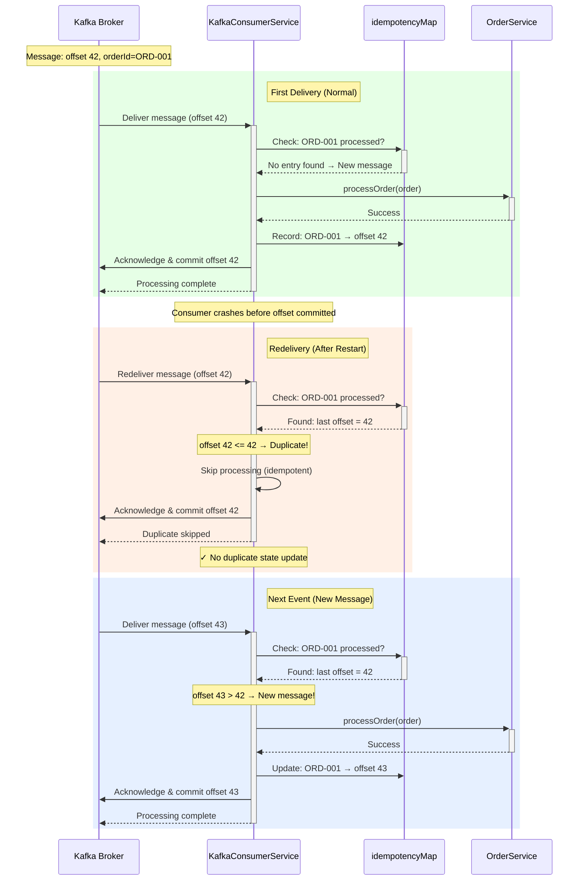
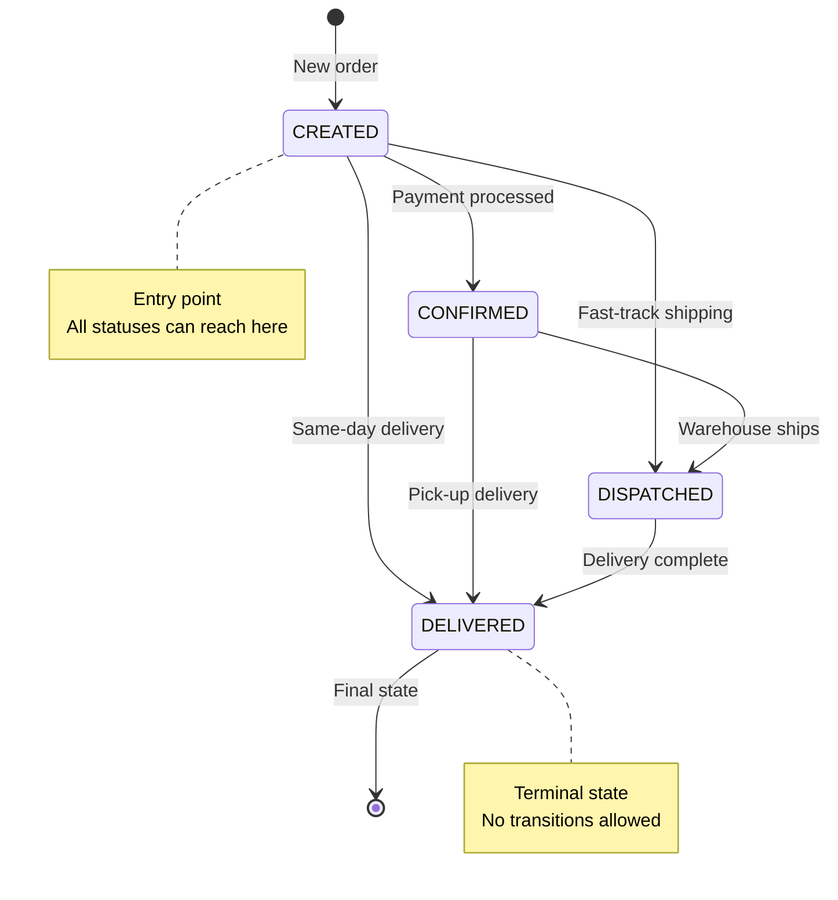
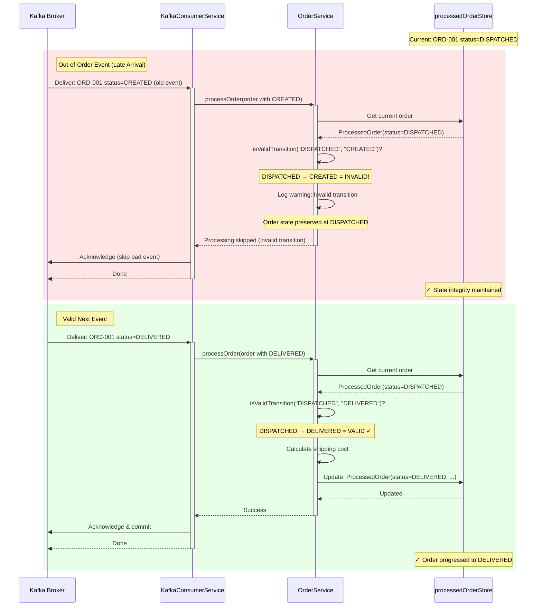
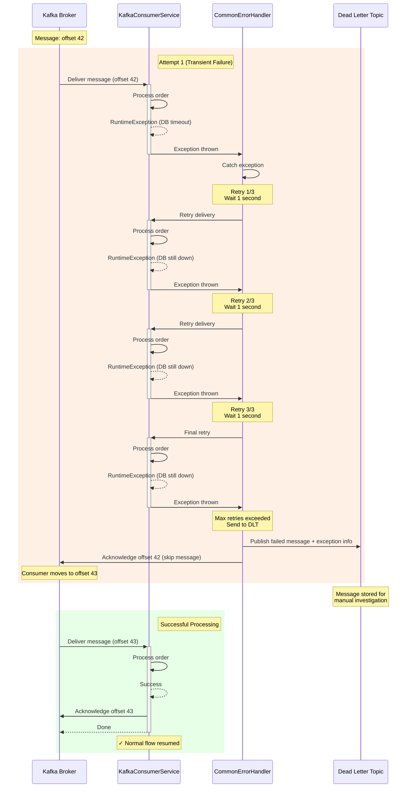
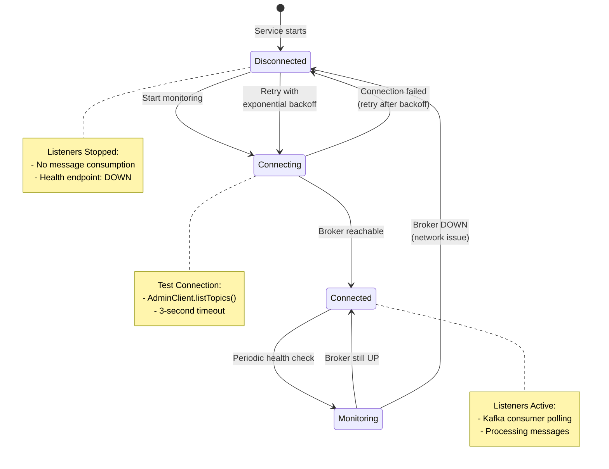

# Error Handling Strategy (Consumer)

The Consumer (Order Service) implements a comprehensive error handling strategy across the **Message Processing Layer**, **State Management Layer**, and **Business Logic Layer** to ensure reliability, idempotency, and consistency in distributed event processing.

**Course Context**: This error handling strategy aligns with **Session 8 - Error Handling & Resilience** from the MTA Event-Driven Architecture course, implementing patterns for idempotency, retry logic, and Dead Letter Topics.

---

## Error Handling Architecture Overview

```mermaid
flowchart TD
    Kafka[Kafka Broker<br/>order-events Topic]
    
    subgraph Consumer["Order Service Consumer"]
        Listener[KafkaConsumerService<br/>@KafkaListener]
        Deserialize{Deserialization<br/>JSON → Order}
        Idempotency{Idempotency Check<br/>Duplicate?}
        Sequencing{Sequencing Check<br/>Valid Transition?}
        Processing[Business Logic<br/>Calculate & Store]
        Ack[Manual Acknowledgment<br/>Commit Offset]
    end
    
    ErrorHandler[CommonErrorHandler<br/>Retry with Backoff]
    DLT[Dead Letter Topic<br/>Failed Messages]
    
    Kafka -->|Poll messages| Listener
    Listener --> Deserialize
    
    Deserialize -->|Success| Idempotency
    Deserialize -.->|IOException| ErrorHandler
    
    Idempotency -->|New message| Sequencing
    Idempotency -->|Duplicate offset| Ack
    
    Sequencing -->|Valid| Processing
    Sequencing -->|Invalid| LogWarn[Log Warning<br/>Preserve State]
    
    Processing --> Ack
    Processing -.->|Exception| ErrorHandler
    
    LogWarn --> Ack
    
    ErrorHandler -.->|Retry 1-3| Listener
    ErrorHandler -.->|Max retries| DLT
    
    Ack -->|Commit offset| Kafka
    
    style Deserialize fill:#ffe1e1
    style Idempotency fill:#fff4e1
    style Sequencing fill:#e1f5ff
    style ErrorHandler fill:#ffe1e1
    style DLT fill:#ffcccc
```

---

## 1. Message Reception & Deserialization Errors (The "Gate Keeper" Layer)

These errors occur when messages arrive from Kafka but fail to be converted into valid `Order` objects. The system handles them through a multi-stage filtering process.

### Level 1: JSON Deserialization Failure (Poison Pill Handling)
- **Error Trigger**: When `ObjectMapper.readValue()` fails to parse the Kafka message value into an `Order` record (malformed JSON, missing fields, type mismatches).
- **Handling**:
  - The exception is caught in `OrderConsumer.listen()` as `JsonProcessingException`.
  - The full raw message is logged with error details for debugging and audit trails.
  - **Critical**: The message is **acknowledged immediately** despite the failure, moving the consumer offset forward.
- **Rationale**: This prevents the consumer from getting stuck in an infinite retry loop on a "poison pill" message (corrupted/malformed data that will never deserialize). The message is lost, but the consumer keeps processing.
- **Log Example**:
  ```
  ERROR: Failed to deserialize message: {"invalid": "json"...
  ```
- **API Impact**: No API exposure (this occurs during asynchronous message processing). The order is never added to the local state.

### Level 2: Message Key Validation (Data Integrity Check)
- **Validation**: After successful deserialization, the consumer verifies that the Kafka message key matches the `orderId` in the message body.
- **Mismatch Behavior**: If `key != order.orderId()`, a warning is logged but processing continues (lenient validation).
- **Rationale**: Kafka partitioning relies on the key for ordering. A mismatch indicates a potential data inconsistency upstream (e.g., producer bug) but doesn't block processing of valid order data.
- **Log Example**:
  ```
  WARN: Message key ORD-123 does not match order body id ORD-456
  ```

---

## 2. State Management Layer: Idempotency & Sequencing (The "Gatekeeper" for State)

These mechanisms prevent duplicate processing and enforce valid state transitions, ensuring the consumer acts as a reliable mirror of the producer's state.

### Idempotency Implementation: Offset-Based Duplicate Detection

**Challenge**: Kafka's At-Least-Once delivery means the same message can be delivered multiple times (e.g., after consumer restart, network partition, rebalancing).

**Solution**: Track processed message offsets per orderId to detect and skip duplicates.

#### Implementation Details

```java
// In KafkaConsumerService
private final ConcurrentMap<String, ProcessedMessageInfo> idempotencyMap = new ConcurrentHashMap<>();

private boolean isMessageAlreadyProcessed(String orderId, long offset) {
    ProcessedMessageInfo existing = idempotencyMap.get(orderId);
    if (existing == null) {
        return false;  // First time seeing this orderId
    }
    // Compare offsets: if new offset <= last processed offset, it's a retry
    return offset <= existing.offset;
}

private void recordProcessedMessage(String orderId, long offset) {
    idempotencyMap.put(orderId, new ProcessedMessageInfo(offset, System.currentTimeMillis()));
}

private record ProcessedMessageInfo(long offset, long processedAt) {}
```

#### Idempotency Flow Diagram



**Key Benefits:**
- ✅ **Prevents duplicate state updates** when Kafka redelivers messages
- ✅ **Lightweight**: In-memory map (O(1) lookup)
- ✅ **Per-orderId tracking**: Different orders processed independently
- ✅ **Offset-based**: Works even if message payload is identical (same Order object)

**Why Offset-Based Detection?**
- Kafka guarantees: Same partition + same offset = same message
- Messages with same orderId always go to same partition (via message key)
- Therefore: orderId + offset uniquely identifies a message
- If offset <= last processed offset → it's a redelivery (duplicate)

---
### State Machine Validation (Sequencing Check)

**Challenge**: Out-of-order message delivery (though rare due to partition ordering) or late-arriving events could corrupt order state.

**Solution**: Enforce a strict state machine for order status transitions.

#### State Machine Diagram



#### Valid Transitions Table

| Current Status | Allowed Next Statuses | Rejected Transitions |
|----------------|----------------------|---------------------|
| `null` (new)   | CREATED, CONFIRMED, DISPATCHED, DELIVERED | None (all allowed) |
| **CREATED**    | CONFIRMED, DISPATCHED, DELIVERED | None |
| **CONFIRMED**  | DISPATCHED, DELIVERED | CREATED (backward) |
| **DISPATCHED** | DELIVERED | CREATED, CONFIRMED (backward) |
| **DELIVERED**  | None (terminal) | All (order complete) |

#### Implementation

```java
private boolean isValidTransition(String currentStatus, String newStatus) {
    if (currentStatus.equals(newStatus)) {
        return true;  // Same status (duplicate or no-op)
    }
    return switch (currentStatus) {
        case "CREATED" -> newStatus.equals("CONFIRMED") || 
                          newStatus.equals("DISPATCHED") || 
                          newStatus.equals("DELIVERED");
        case "CONFIRMED" -> newStatus.equals("DISPATCHED") || 
                            newStatus.equals("DELIVERED");
        case "DISPATCHED" -> newStatus.equals("DELIVERED");
        case "DELIVERED" -> false;  // Terminal state
        default -> true;  // Unknown statuses: allow (defensive posture)
    };
}
```

#### Sequencing Validation Flow



**Handling Invalid Transitions:**
- **Action**: Log warning with current and attempted status
- **State**: Preserved (not updated with invalid status)
- **Acknowledgment**: Message is still acknowledged (prevents blocking)
- **Rationale**: Late-arriving events shouldn't block processing; state machine prevents corruption

**Example Log**:
```
WARN [OrderService]: Invalid transition: Order ORD-001 cannot move from DISPATCHED to CREATED. Rejecting update.
  Current State: ProcessedOrder(Order(orderId=ORD-001, status=DISPATCHED, ...), shippingCost=15.50)
  Incoming Event: Order(orderId=ORD-001, status=CREATED, ...)
```

---
---

## 3. Retry and Dead Letter Topic (DLT) Pattern

**Challenge**: Transient failures (network glitches, temporary DB unavailability) and permanent failures (corrupt data, unrecoverable errors) need different handling strategies.

**Solution**: Implement retry with exponential backoff for transient failures, and route unrecoverable messages to a Dead Letter Topic.

### Retry Strategy with CommonErrorHandler

The Consumer uses Spring Kafka's `CommonErrorHandler` with exponential backoff:

```java
@Bean
public CommonErrorHandler errorHandler() {
    DefaultErrorHandler errorHandler = new DefaultErrorHandler(
        new FixedBackOff(1000L, 3L)  // 1 second interval, 3 retries
    );
    
    errorHandler.addNotRetryableExceptions(  // Immediately send to DLT
        JsonProcessingException.class,        // Malformed JSON
        DeserializationException.class        // Deserialization error
    );
    
    return errorHandler;
}
```

**Retry Configuration:**
- **Initial Delay**: 1 second
- **Max Attempts**: 3 retries (4 total attempts including original)
- **Backoff**: Fixed (can be changed to exponential)
- **Non-Retryable Exceptions**: Deserialization errors (poison pills)

### Retry and DLT Flow Diagram



### Dead Letter Topic (DLT) Details

**Purpose**: Store messages that fail processing after all retry attempts.

**DLT Configuration:**
```properties
# Automatically created by Spring Kafka
# Pattern: {original-topic}.DLT
# Example: order-events.DLT
```

**DLT Message Headers:**
```json
{
  "kafka_dlt-original-topic": "order-events",
  "kafka_dlt-original-partition": "0",
  "kafka_dlt-original-offset": "42",
  "kafka_dlt-exception-message": "Failed to process order: DB connection timeout",
  "kafka_dlt-exception-stacktrace": "...",
  "kafka_dlt-original-timestamp": "2026-01-03T10:30:00.000Z"
}
```

**DLT Processing Options:**

1. **Manual Investigation**:
   - DevOps team monitors DLT
   - Analyze failed messages
   - Fix root cause (e.g., restore DB)
   - Manually replay messages

2. **Automated Replay**:
   - Separate consumer reads from DLT
   - Applies fix/transformation
   - Republishes to original topic

3. **Alerting**:
   - Monitor DLT message count
   - Alert if count exceeds threshold
   - Indicates systemic issue

**When Messages Go to DLT:**
- ✅ **After 3 failed retries** (transient errors)
- ✅ **Immediately** for non-retryable exceptions (poison pills)
- ✅ **Processing exceptions** (business logic errors)
- ❌ **NOT** for valid messages that are rejected by sequencing validation

### Kafka Connectivity Monitoring

The Consumer implements `KafkaConnectivityService` for broker monitoring:

#### Connectivity Monitoring Flow



**Implementation Features:**
- **Async Monitoring**: Non-blocking background thread
- **Exponential Backoff**: 2s → 4s → 8s → 16s → 32s → 60s max
- **Infinite Retries**: Never gives up connecting
- **Listener Management**: Auto-start/stop based on connectivity
- **Health Reporting**: Exposes Kafka status via `/health/ready` endpoint

**Benefits:**
- ✅ **Graceful Degradation**: Consumer continues running when Kafka is down
- ✅ **Auto-Recovery**: Automatically reconnects when Kafka comes back up
- ✅ **No Crash Loops**: Doesn't crash/restart container on Kafka unavailability
- ✅ **Load Balancer Integration**: Health endpoint enables traffic routing

---
- **Mechanism**: `OrderUtils.calculateShippingCost()` computes the shipping cost based on order total.
- **Formula**:
  ```
  Shipping Cost = 2% of total amount
  ```
- **Error Handling**: 
  - Negative or zero total amounts are processed as-is (no validation error; the order comes from the trusted producer).
  - Calculation is a simple multiplication with no external dependencies.
- **Rationale**: This is deterministic logic; the same order always produces the same shipping cost. No external dependencies mean no transient failures here.

---

## 3. State Update & Persistence Layer (The "Commit Point")

Once an order passes idempotency and sequencing checks, it must be safely persisted to the local store before acknowledgment.

### Level 1: Atomic State Update
- **Mechanism**: `processedOrderStore.put(orderId, processedOrder)` updates the concurrent map atomically.
- **Data Structure**: `Map<String, ProcessedOrder>` where `ProcessedOrder` wraps the `Order` and its calculated `shippingCost`.
- **Thread Safety**: Uses `ConcurrentHashMap` for lock-free, thread-safe updates.
- **Failure Scenarios**:
  - **Memory Exhaustion**: If the system runs out of memory during `put()`, an `OutOfMemoryError` is thrown. The consumer stops; Kubernetes/Docker will restart it. The message is **not acknowledged**, so it will be reprocessed after restart.
  - **Concurrent Access**: Multiple Kafka listener threads may update different `orderId` keys simultaneously. The map ensures this is safe; no data corruption.

### Level 2: Acknowledgment (Offset Commit)
- **Mechanism**: `Acknowledgment.acknowledge()` is called in `OrderConsumer.listen()` **only after** the state update succeeds.
- **Timing**: 
  ```
  Try {
      deserialize -> validate -> check idempotency -> check sequencing -> calculate shipping -> update state
      [IF ALL SUCCEED]: acknowledge()
  } Catch (JsonProcessingException) {
      acknowledge() // Still acknowledge to move past poison pill
  } Catch (Exception) {
      acknowledge() // Catch-all; log and acknowledge
  }
  ```
- **Rationale**: 
  - If the state update fails, the message is **not acknowledged**, and Kafka will re-deliver it after the consumer restart.
  - This ensures "At-Least-Once" delivery with the guarantee that no order event is lost due to a consumer crash.
- **Log Example**:
  ```
  INFO: Successfully acknowledged message for order ORD-001. Offset: 42
  ```

---

## Phase 4: Resilience & Error Handling Implementation

### GlobalExceptionHandler Integration
The consumer implements a **GlobalExceptionHandler** to centrally manage all API exceptions and provide consistent error responses across all endpoints.

#### **Exception Handlers Implemented (6 Total)**

**1. MethodArgumentNotValidException** → HTTP 400
- **When**: DTO validation fails (@NotBlank, @Pattern)
- **Logging**: `logger.warn("Validation error: {}")`
- **Response**: Includes field-level error details
- **Example**: Empty orderId fails @NotBlank validation

**2. HttpMessageNotReadableException** → HTTP 400
- **When**: Malformed JSON in request body
- **Logging**: `logger.warn("Malformed JSON received: {}")`
- **Response**: Generic "Invalid request body" message
- **Example**: Invalid JSON syntax in POST body

**3. InvalidOrderIdException** → HTTP 400
- **When**: Custom exception for invalid orderId format
- **Logging**: `logger.warn("Invalid orderId format: {}")`
- **Response**: Includes orderId and hex format requirement
- **Example**: OrderId "XYZ" (X, Y, Z not hexadecimal)

**4. IllegalArgumentException** → HTTP 400
- **When**: OrderUtils.normalizeOrderId() throws for invalid hex
- **Logging**: `logger.warn("Illegal argument error: {}")`
- **Response**: Error message from exception
- **Example**: normalizeOrderId() validation failure

**5. OrderNotFoundException** → HTTP 404
- **When**: Order not found in state store
- **Logging**: `logger.info("Order not found: {}")`
- **Response**: Includes orderId in details
- **Example**: Query for non-existent order

**6. Exception (Catch-All)** → HTTP 500
- **When**: Any unhandled exception
- **Logging**: `logger.error("Unhandled error: {}", ex.getMessage(), ex)` (with full stack trace)
- **Response**: Generic "Internal Server Error" message
- **Example**: NullPointerException, OutOfMemoryError, etc.

### HealthService Integration
The consumer implements a **HealthService** to monitor service health and dependencies:

#### **Service Health Check** (`getServiceStatus()`)
- Returns `HealthCheck("UP", "Order Service is running and responsive")`
- Checks if the service method is callable
- On exception: Returns `HealthCheck("DOWN", "Service error: ...")`

#### **Kafka Broker Health Check** (`getKafkaStatus()`)
- Attempts to verify Kafka connectivity via `KafkaTemplate`
- Returns `HealthCheck("UP", "Kafka broker is accessible")` on success
- On exception: Returns `HealthCheck("DOWN", "Kafka broker is unavailable: ...")`
- Critical for readiness probe

#### **Local State Store Health Check** (`getLocalStateStatus()`)
- Verifies in-memory `processedOrderStore` is accessible
- Returns `HealthCheck("UP", "Local order state store is accessible")`
- On exception: Returns `HealthCheck("DOWN", "Local state store is unavailable: ...")`

### Health Probes in OrderController

#### **Liveness Probe** (GET /order-service/health/live)
```json
{
  "serviceName": "Order Service (Consumer)",
  "type": "liveness",
  "status": "UP",
  "timestamp": "2026-01-02T12:00:00.123456Z",
  "checks": {
    "service": {"status": "UP", "details": "Order Service is running and responsive"}
  }
}
```
- **HTTP Status**: Always 200 OK (if service is running)
- **Purpose**: Docker/Kubernetes uses this to detect dead containers
- **Logging**: `logger.debug("Liveness probe called")`

#### **Readiness Probe** (GET /order-service/health/ready)
**When Kafka is UP:**
```json
{
  "serviceName": "Order Service (Consumer)",
  "type": "readiness",
  "status": "UP",
  "timestamp": "2026-01-02T12:00:00.123456Z",
  "checks": {
    "service": {"status": "UP", "details": "Order Service is running and responsive"},
    "kafka": {"status": "UP", "details": "Kafka broker is accessible"},
    "local-state": {"status": "UP", "details": "Local order state store is accessible"}
  }
}
```
- **HTTP Status**: 200 OK
- **Purpose**: Service is ready to process requests

**When Kafka is DOWN:**
```json
{
  "serviceName": "Order Service (Consumer)",
  "type": "readiness",
  "status": "DOWN",
  "timestamp": "2026-01-02T12:00:00.123456Z",
  "checks": {
    "service": {"status": "UP", "details": "Order Service is running and responsive"},
    "kafka": {"status": "DOWN", "details": "Kafka broker is unavailable: Connection refused"},
    "local-state": {"status": "UP", "details": "Local order state store is accessible"}
  }
}
```
- **HTTP Status**: 503 Service Unavailable
- **Purpose**: Kubernetes removes service from load balancer
- **Logging**: `logger.debug("Readiness probe called")`

---

## Phase 5: Request Validation Error Handling

### OrderDetailsRequest Validation
**Input:**
```json
{"orderId": "ABC123DEF"}
```

**Validation Checks:**
1. `@NotBlank` → Checks if orderId is not null/empty
   - Failure: HTTP 400, Message: "orderId is required and cannot be empty"
2. `@Pattern(regexp = "^[0-9A-Fa-f]+$")` → Validates hexadecimal format
   - Failure: HTTP 400, Message: "orderId must be in hexadecimal format (0-9, A-F)"

**Example Invalid Requests:**
```
❌ {"orderId": ""} → 400 Bad Request
❌ {"orderId": "XYZ-@#$"} → 400 Bad Request
❌ {"orderId": "G1234"} → 400 Bad Request (G is not hex)
✅ {"orderId": "ABC123"} → Proceeds to OrderService
```

### AllOrdersFromTopicRequest Validation
**Validation Check:**
- `@NotBlank` → Ensures topicName is provided
  - Failure: HTTP 400, Message: "topicName is required"

---

## 5. Exception Handling & Recovery

### Global Exception Handler (OrderConsumer)
The `OrderConsumer` implements multi-layer exception handling:

| Exception Type | Catch Location | Action | Acknowledgment |
|---|---|---|---|
| `JsonProcessingException` | `OrderConsumer.listen()` | Log error with raw message; proceed | **Yes** (poison pill) |
| `Exception` (catch-all) | `OrderConsumer.listen()` | Log error; proceed | **Yes** (fail-safe) |
| `Exception` in `processOrder()` | Not caught locally | Propagates to `OrderConsumer`; logged | Depends on catch above |

### Recovery Workflow

1. **Deserialization Failure**:
   - Message is logged but acknowledged.
   - Consumer continues processing next message.
   - **Recovery**: Administrator reviews logs; no data is lost (raw message captured).

2. **Invalid State Transition**:
   - Message is logged as warning; order state is preserved.
   - No state corruption occurs.
   - **Recovery**: Automatic (next valid event will succeed).

3. **Duplicate Event**:
   - Message is logged as info; silently skipped.
   - **Recovery**: Automatic (idempotency ensures harmless reprocessing).

4. **Consumer Crash**:
   - Any in-flight message is not acknowledged.
   - Upon restart, Kafka re-delivers the message from the last committed offset.
   - **Recovery**: Automatic (Kafka rebalancing + At-Least-Once semantics).

---

## 6. Error Response Examples

### Deserialization Error (Logged)
```
ERROR [OrderConsumer]: Failed to deserialize message: {"invalid_json"
at com.fasterxml.jackson.databind.ObjectMapper.readValue(...)
Message key: ORD-123
Partition: 0, Offset: 1025
```

### Invalid State Transition (Logged)
```
WARN [OrderService]: Invalid transition: Order ORD-001 cannot move from DISPATCHED to CREATED. Rejecting update.
  Current State: ProcessedOrder(Order(orderId=ORD-001, status=DISPATCHED, ...), shippingCost=15.50)
  Incoming Event: Order(orderId=ORD-001, status=CREATED, ...)
```

### Duplicate Event (Logged)
```
INFO [OrderService]: Duplicate event: Order ORD-001 already in state CONFIRMED. Skipping.
  Previous: ProcessedOrder(Order(..., status=CONFIRMED, ...), shippingCost=10.25)
  Incoming: Order(..., status=CONFIRMED, ...) [identical]
```

### Order Not Found (API Response)
```json
{
  "timestamp": "2026-01-02T12:00:00.000Z",
  "error": "Not Found",
  "message": "Order with ID ORD-999 not found in the system.",
  "path": "/order-details/ORD-999"
}
```

---

## 7. Design Patterns Summary

| Pattern | Implementation | Purpose |
|---|---|---|
| **Idempotency** | `Order.equals()` check before state update | Ensure duplicate messages don't corrupt state |
| **State Machine** | `isValidTransition()` validation | Prevent out-of-order events from degrading state |
| **Poison Pill Handling** | Acknowledge after deserialization failure | Prevent consumer from blocking on malformed messages |
| **At-Least-Once Delivery** | Acknowledge only after successful state update | Guarantee no order events are lost |
| **Fail-Safe Logging** | Log all errors with full context | Enable manual recovery if needed |
| **Defensive Defaults** | Allow unknown status transitions | Future-proof for new order states |

---

## Future Enhancements (Phase 4+)

- **Distributed Tracing**: Add correlation IDs to track orders across producer and consumer.
- **Metrics & Monitoring**: Export Micrometer metrics for idempotency checks, transition failures, and message lag.
- **Dead Letter Queue (DLQ)**: Store irreparably damaged messages (beyond poison pills) for manual inspection.
- **Circuit Breaker on State Access**: If the state store becomes unavailable (edge case), fail gracefully with 503.
- **Event Audit Trail**: Store all received events (even rejected ones) for compliance/debugging.

