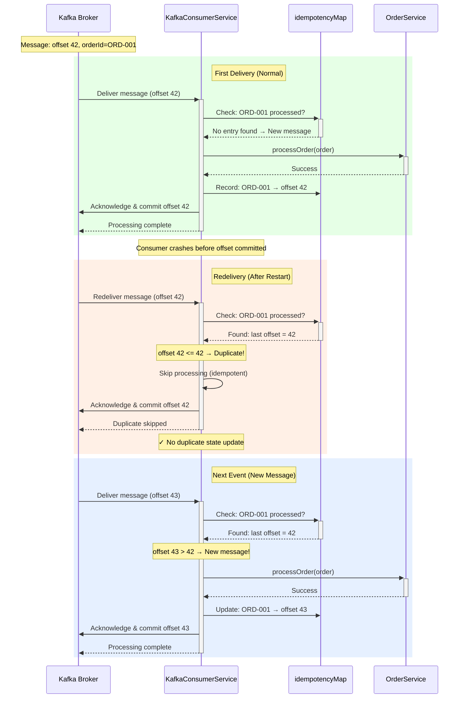
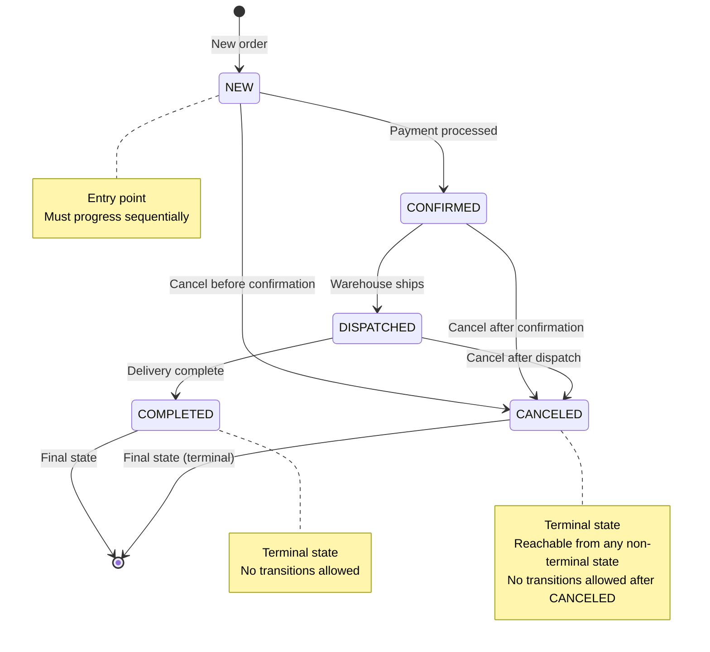
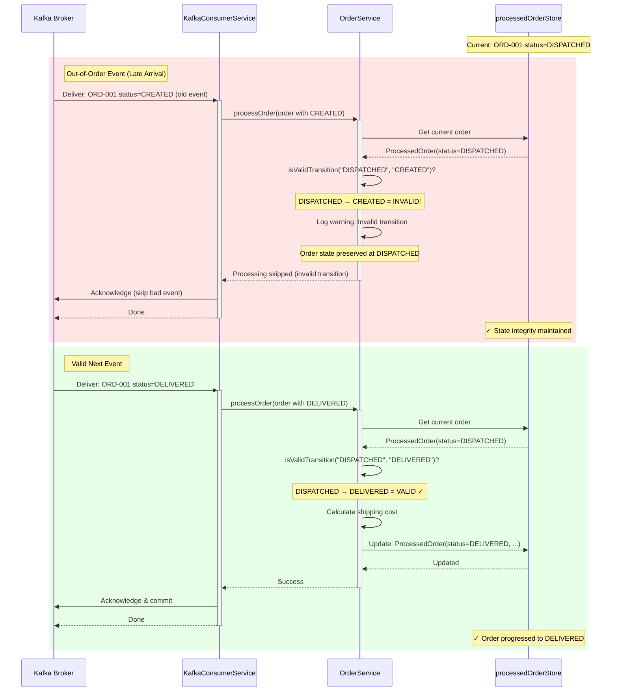
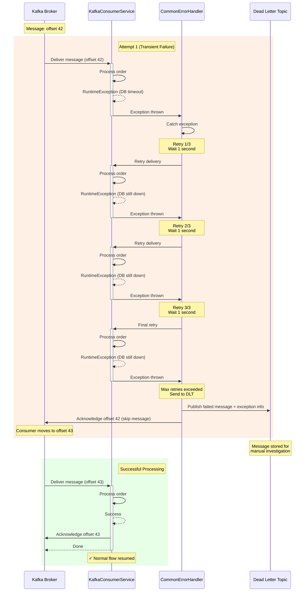
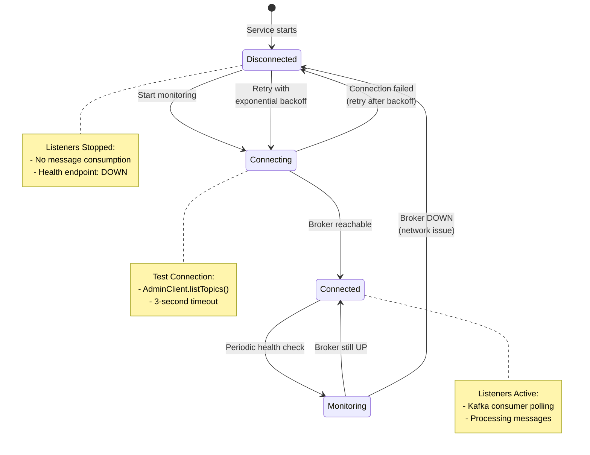

# Error Handling Strategy (Consumer)

The Consumer (Order Service) implements a comprehensive error handling strategy across the **Message Processing Layer**, **State Management Layer**, and **Business Logic Layer** to ensure reliability, idempotency, and consistency in distributed event processing.

**Course Context**: This error handling strategy aligns with **Session 8 - Error Handling & Resilience** from the MTA Event-Driven Architecture course, implementing patterns for idempotency, retry logic, and Dead Letter Topics.

---

## Error Handling Architecture Overview

```mermaid
flowchart TD
    Kafka[Kafka Broker<br/>order-events Topic]
    
    subgraph Consumer["Order Service Consumer"]
        Listener[KafkaConsumerService<br/>@KafkaListener]
        Deserialize{Deserialization<br/>JSON → Order}
        Idempotency{Idempotency Check<br/>Duplicate?}
        Sequencing{Sequencing Check<br/>Valid Transition?}
        Processing[Business Logic<br/>Calculate & Store]
        Ack[Manual Acknowledgment<br/>Commit Offset]
    end
    
    ErrorHandler[CommonErrorHandler<br/>Retry with Backoff]
    DLT[Dead Letter Topic<br/>Failed Messages]
    
    Kafka -->|Poll messages| Listener
    Listener --> Deserialize
    
    Deserialize -->|Success| Idempotency
    Deserialize -.->|IOException| ErrorHandler
    
    Idempotency -->|New message| Sequencing
    Idempotency -->|Duplicate offset| Ack
    
    Sequencing -->|Valid| Processing
    Sequencing -->|Invalid| LogWarn[Log Warning<br/>Preserve State]
    
    Processing --> Ack
    Processing -.->|Exception| ErrorHandler
    
    LogWarn --> Ack
    
    ErrorHandler -.->|Retry 1-3| Listener
    ErrorHandler -.->|Max retries| DLT
    
    Ack -->|Commit offset| Kafka
    
    style Deserialize fill:#ffe1e1
    style Idempotency fill:#fff4e1
    style Sequencing fill:#e1f5ff
    style ErrorHandler fill:#ffe1e1
    style DLT fill:#ffcccc
```

---

## 1. Message Reception & Deserialization Errors (The "Gate Keeper" Layer)

These errors occur when messages arrive from Kafka but fail to be converted into valid `Order` objects. The system handles them through a multi-stage filtering process.

### Level 1: JSON Deserialization Failure (Poison Pill Handling)
- **Error Trigger**: When `ObjectMapper.readValue()` fails to parse the Kafka message value into an `Order` record (malformed JSON, missing fields, type mismatches).
- **Handling**:
  - The exception is caught in `OrderConsumer.listen()` as `JsonProcessingException`.
  - The full raw message is logged with error details for debugging and audit trails.
  - **Critical**: The message is **acknowledged immediately** despite the failure, moving the consumer offset forward.
- **Rationale**: This prevents the consumer from getting stuck in an infinite retry loop on a "poison pill" message (corrupted/malformed data that will never deserialize). The message is lost, but the consumer keeps processing.
- **Log Example**:
  ```
  ERROR: Failed to deserialize message: {"invalid": "json"...
  ```
- **API Impact**: No API exposure (this occurs during asynchronous message processing). The order is never added to the local state.

### Level 2: Message Key Validation (Data Integrity Check)
- **Validation**: After successful deserialization, the consumer verifies that the Kafka message key matches the `orderId` in the message body.
- **Mismatch Behavior**: If `key != order.orderId()`, a warning is logged but processing continues (lenient validation).
- **Rationale**: Kafka partitioning relies on the key for ordering. A mismatch indicates a potential data inconsistency upstream (e.g., producer bug) but doesn't block processing of valid order data.
- **Log Example**:
  ```
  WARN: Message key ORD-123 does not match order body id ORD-456
  ```

---

## 2. State Management Layer: Idempotency & Sequencing (The "Gatekeeper" for State)

These mechanisms prevent duplicate processing and enforce valid state transitions, ensuring the consumer acts as a reliable mirror of the producer's state.

### Idempotency Implementation: Dual-Layer Duplicate Detection

**Challenge**: Kafka's At-Least-Once delivery means the same message can be delivered multiple times (e.g., after consumer restart, network partition, rebalancing).

**Solution**: The consumer implements **two complementary layers** of idempotency checking:

1. **Layer 1: Offset-Based Detection (KafkaConsumerService)** - Detects exact message redeliveries
2. **Layer 2: State-Based Detection (OrderService)** - Detects duplicate status updates

#### Layer 1: Offset-Based Idempotency (KafkaConsumerService)

This layer detects when Kafka redelivers the **exact same message** (same offset) after a failure or restart.

**Implementation:**

```java
// In KafkaConsumerService
private final ConcurrentMap<String, ProcessedMessageInfo> idempotencyMap = new ConcurrentHashMap<>();

private boolean isMessageAlreadyProcessed(String orderId, long offset) {
    ProcessedMessageInfo existing = idempotencyMap.get(orderId);
    if (existing == null) {
        return false;  // First time seeing this orderId
    }
    // Compare offsets: if new offset <= last processed offset, it's a retry
    return offset <= existing.offset;
}

private void recordProcessedMessage(String orderId, long offset) {
    idempotencyMap.put(orderId, new ProcessedMessageInfo(offset, System.currentTimeMillis()));
}

private record ProcessedMessageInfo(long offset, long processedAt) {}
```

**When It Triggers:**
- Message at offset 42 is processed and acknowledged
- Consumer crashes before offset is fully committed
- Kafka redelivers the same message (offset 42) on restart
- Idempotency check detects `offset 42 <= 42` and skips processing

#### Layer 2: State-Based Idempotency (OrderService)

This layer detects when an order already has the **same status** in the state store (duplicate event, not necessarily same message).

**Implementation:**

```java
// In OrderService
public void processOrder(Order order) {
    String orderId = order.orderId();
    ProcessedOrder current = processedOrderStore.get(orderId);

    // Idempotency check - if we already have this exact order state, skip
    // This handles duplicate events (same orderId + same status = same event)
    if (current != null && current.order().status().equals(order.status())) {
        logger.info("⊘ Idempotency Check: Order {} already in state '{}'. Skipping duplicate.",
                orderId, order.status());
        return;
    }
    
    // Continue with state transition validation and processing...
}
```

**When It Triggers:**
- Order ORD-001 is already in state "CONFIRMED"
- A new message arrives with orderId=ORD-001, status="CONFIRMED"
- State-based check detects duplicate status and skips processing
- This works even if the messages have different offsets (e.g., producer sent duplicate)

#### Why Two Layers?

| Layer | Detects | Example Scenario | Protection |
|-------|---------|------------------|------------|
| **Offset-Based** | Exact message redelivery | Consumer crashes mid-processing, Kafka redelivers same offset | Prevents reprocessing after failure/restart |
| **State-Based** | Duplicate status events | Producer accidentally sends duplicate, or late-arriving message | Prevents state corruption from logical duplicates |

**Combined Protection:**
- Offset-based catches Kafka-level redeliveries (infrastructure failure)
- State-based catches application-level duplicates (business logic)
- Together, they ensure **exactly-once semantics** at the business logic level, even with at-least-once delivery

#### Idempotency Flow Diagram



**Key Benefits:**
- ✅ **Prevents duplicate state updates** when Kafka redelivers messages
- ✅ **Lightweight**: In-memory map (O(1) lookup)
- ✅ **Per-orderId tracking**: Different orders processed independently
- ✅ **Offset-based**: Works even if message payload is identical (same Order object)

**Why Offset-Based Detection?**
- Kafka guarantees: Same partition + same offset = same message
- Messages with same orderId always go to same partition (via message key)
- Therefore: orderId + offset uniquely identifies a message
- If offset <= last processed offset → it's a redelivery (duplicate)

---
### State Machine Validation (Sequencing Check)

**Challenge**: Out-of-order message delivery (though rare due to partition ordering) or late-arriving events could corrupt order state.

**Solution**: Enforce a strict state machine for order status transitions.

#### State Machine Diagram



**Key State Machine Rules:**
- **Strictly Sequential**: Must progress NEW → CONFIRMED → DISPATCHED → COMPLETED (one step at a time)
- **No Skipping**: Cannot skip states (e.g., NEW → DISPATCHED is invalid)
- **CANCELED Exception**: Can transition to CANCELED from any non-terminal state (NEW, CONFIRMED, DISPATCHED)
- **Terminal States**: COMPLETED and CANCELED are terminal; no further transitions allowed

#### Valid Transitions Table

| Current Status | Allowed Next Status | Rejected Transitions |
|----------------|---------------------|---------------------|
| `null` (new)   | **ANY VALID STATUS** (NEW, CONFIRMED, DISPATCHED, COMPLETED, CANCELED) | None - first creation is flexible |
| **NEW**        | **CONFIRMED only** (or CANCELED) | DISPATCHED, COMPLETED (must progress sequentially) |
| **CONFIRMED**  | **DISPATCHED only** (or CANCELED) | NEW (backward), COMPLETED (must progress sequentially) |
| **DISPATCHED** | **COMPLETED only** (or CANCELED) | NEW, CONFIRMED (backward) |
| **COMPLETED**  | **CANCELED only** | All except CANCELED |
| **CANCELED**   | None (terminal) | All (order canceled, cannot transition) |

**Important: Strictly Sequential Transitions (After Initial Creation)**
- First order creation (null → X): Can start in **any valid status** (flexible for producer)
- After initial creation: **Must** follow NEW → CONFIRMED → DISPATCHED → COMPLETED (one step at a time)
- Examples of **INVALID** transitions after initial creation:
  - NEW → DISPATCHED ❌ (must go NEW → CONFIRMED → DISPATCHED)
  - NEW → COMPLETED ❌ (must progress through all intermediate states)
  - CONFIRMED → COMPLETED ❌ (must go CONFIRMED → DISPATCHED → COMPLETED)
- Only exception: **CANCELED** can be reached from **any state** (including COMPLETED)
- Terminal states: CANCELED cannot transition to any other state

#### Implementation

```java
private boolean isValidTransition(String currentStatus, String newStatus) {
    if (currentStatus.equals(newStatus)) {
        return true;  // Same status (duplicate or no-op)
    }
    
    // Get status progression order
    int currentOrder = getStatusOrder(currentStatus);  // NEW=0, CONFIRMED=1, DISPATCHED=2, COMPLETED=3, CANCELED=4
    int newOrder = getStatusOrder(newStatus);
    
    // CANCELED is terminal - can be reached from any non-terminal state
    if (newStatus.equalsIgnoreCase("CANCELED") || newStatus.equalsIgnoreCase("CANCELLED")) {
        return true;  // Allow transition to CANCELED from any state
    }
    
    // All other transitions must be STRICTLY SEQUENTIAL (one step at a time)
    // Only allow newOrder = currentOrder + 1
    // Examples:
    //   NEW (0) → CONFIRMED (1): valid (1 == 0+1) ✅
    //   CONFIRMED (1) → DISPATCHED (2): valid (2 == 1+1) ✅
    //   NEW (0) → DISPATCHED (2): invalid (2 != 0+1) ❌
    //   CONFIRMED (1) → COMPLETED (3): invalid (3 != 1+1) ❌
    return newOrder == currentOrder + 1;
}
```

**Key Implementation Details:**
- First-time creation (currentStatus = null): Any valid status is allowed
- Uses `getStatusOrder()` to map statuses to numeric values (NEW=0, CONFIRMED=1, DISPATCHED=2, COMPLETED=3, CANCELED=4)
- Enforces **strictly sequential** progression after initial creation: `newOrder == currentOrder + 1`
- Exception: CANCELED can be reached from **any state** (including COMPLETED)
- Terminal state: CANCELED cannot transition to any other state

#### Sequencing Validation Flow



**Handling Invalid Transitions:**
- **Action**: Log warning with current and attempted status
- **State**: Preserved (not updated with invalid status)
- **Acknowledgment**: Message is still acknowledged (prevents blocking)
- **Rationale**: Late-arriving events shouldn't block processing; state machine prevents corruption

**Example Log**:
```
WARN [OrderService]: Invalid transition: Order ORD-001 cannot move from DISPATCHED to CREATED. Rejecting update.
  Current State: ProcessedOrder(Order(orderId=ORD-001, status=DISPATCHED, ...), shippingCost=15.50)
  Incoming Event: Order(orderId=ORD-001, status=CREATED, ...)
```

---
---

## 3. Retry and Dead Letter Topic (DLT) Pattern

**Challenge**: Transient failures (network glitches, temporary DB unavailability) and permanent failures (corrupt data, unrecoverable errors) need different handling strategies.

**Solution**: Implement retry with exponential backoff for transient failures, and route unrecoverable messages to a Dead Letter Topic.

### Retry Strategy with CommonErrorHandler

The Consumer uses Spring Kafka's `DefaultErrorHandler` with exponential backoff configured in `KafkaConsumerConfig.java`:

```java
@Bean
public ConcurrentKafkaListenerContainerFactory<String, String> kafkaListenerContainerFactory(
        ConsumerFactory<String, String> consumerFactory,
        KafkaTemplate<String, String> kafkaTemplate) {
    
    ConcurrentKafkaListenerContainerFactory<String, String> factory =
            new ConcurrentKafkaListenerContainerFactory<>();
    factory.setConsumerFactory(consumerFactory);
    factory.getContainerProperties().setAckMode(ContainerProperties.AckMode.MANUAL_IMMEDIATE);
    
    // Configure native error handling with exponential backoff and DLT
    // Retry Pattern (optimized for fast recovery):
    // - Initial interval: 1 second
    // - Multiplier: 2.0 (exponential)
    // - Max interval: 10 seconds
    // - Max attempts: 3 retries
    // Retry sequence: 1s, 2s, 4s (total ~7 seconds before DLT)
    ExponentialBackOff backOff = new ExponentialBackOff(1000, 2.0);
    backOff.setMaxInterval(10000);  // Cap at 10 seconds
    
    DefaultErrorHandler errorHandler = new DefaultErrorHandler(
            new DeadLetterPublishingRecoverer(kafkaTemplate),  // Send to DLT on final failure
            backOff
    );
    
    factory.setCommonErrorHandler(errorHandler);
    factory.setAutoStartup(true);  // Enable auto-startup for immediate consumption
    
    return factory;
}
```

**Retry Configuration:**
- **Initial Delay**: 1 second (fast first retry)
- **Multiplier**: 2.0 (exponential backoff)
- **Max Interval**: 10 seconds (cap to prevent long waits)
- **Max Attempts**: 3 retries (4 total attempts including original)
- **Retry Sequence**: 1s → 2s → 4s (total ~7 seconds before DLT)
- **Benefits**: Fast recovery from transient failures while preventing infinite retry loops

### Retry and DLT Flow Diagram



### Dead Letter Topic (DLT) Details

**Purpose**: Store messages that fail processing after all retry attempts.

**DLT Topic Configuration** (automatic via Spring Kafka):
- **Topic Name**: `orders.DLT` (Spring Kafka naming convention: `{source-topic}.DLT`)
- **Auto-Created**: Yes, by Kafka on first failed message
- **Partitions**: Managed automatically by Kafka
- **Key Preservation**: `orderId` maintained from original message
- **Handler**: `DeadLetterPublishingRecoverer` configured in `KafkaConsumerConfig`

**Why Spring Kafka's Native DLT?**
- ✅ **Zero Configuration**: No application.properties needed
- ✅ **Standard Pattern**: Industry-standard Spring Kafka approach
- ✅ **Rich Metadata**: Automatic headers with exception details and stack traces
- ✅ **Reliable**: Battle-tested by Spring Kafka framework
- ✅ **Simpler Codebase**: Less custom code to maintain

**DLT Message Format:**
```json
{
  "headers": {
    "kafka_dlt-original-topic": "orders",
    "kafka_dlt-original-partition": "0",
    "kafka_dlt-original-offset": "42",
    "kafka_dlt-original-timestamp": "1704364200000",
    "kafka_dlt-exception-fqcn": "java.io.IOException",
    "kafka_dlt-exception-message": "Failed to deserialize order",
    "kafka_dlt-exception-stacktrace": "java.io.IOException: ...\n\tat mta.eda.consumer..."
  },
  "key": "ORD-123456",
  "value": "{original JSON message payload}"
}
```

**DLT Processing Options:**

1. **Manual Investigation**:
   - DevOps team monitors `orders.DLT` topic
   - Analyze failed messages using Spring Kafka's exception headers
   - Fix root cause (e.g., code bug, schema issue, data quality)
   - Manually replay messages from DLT to `orders` topic

2. **Automated Replay** (Future Enhancement):
   - Separate consumer reads from `orders.DLT`
   - Uses `kafka_dlt-exception-fqcn` to categorize error types
   - Applies fix/transformation for recoverable errors
   - Republishes to `orders` topic using same `orderId` key
   - Partition routing ensures messages process in order

3. **Alerting & Monitoring**:
   - Monitor `orders.DLT` message count
   - Alert if messages appear (indicates systemic issue)
   - Track `kafka_dlt-exception-fqcn` patterns
   - Examples:
     - High `IOException` count → Data quality issue from producer
     - High `TimeoutException` → Database or network issue
     - High `JsonProcessingException` → Schema mismatch

**When Messages Go to DLT:**
- ✅ **After 3 failed retries** (1s, 2s, 4s exponential backoff)
- ✅ **All exception types** (deserialization, validation, business logic)
- ✅ **Automatic offset commit** after DLT send (prevents infinite loops)
- ❌ **NOT** for valid messages that pass idempotency checks (these are skipped silently)

### Kafka Connectivity Monitoring

The Consumer implements `KafkaConnectivityService` for broker monitoring with Resilience4j exponential backoff:

#### Connectivity Monitoring Configuration

```java
// Configure Resilience4j Retry with exponential backoff
// Optimized for faster initial recovery: start at 100ms and cap at 5s
// Retry sequence: 100ms, 200ms, 400ms, 800ms, 1.6s, 3.2s, 5s, 5s... (capped at 5s)
RetryConfig retryConfig = RetryConfig.custom()
        .maxAttempts(Integer.MAX_VALUE)                          // Infinite retries
        .intervalFunction(
                io.github.resilience4j.core.IntervalFunction.ofExponentialBackoff(
                        100,    // Initial interval: 100ms for aggressive first retries
                        2.0,    // Multiplier: 2x exponential
                        5000    // Max interval: 5 seconds to keep reconnects responsive
                )
        )
        .retryOnException(e -> true)                             // Retry on any exception
        .failAfterMaxAttempts(false)                             // Never give up
        .build();
```

**Monitoring Configuration:**
- **Initial Retry**: 100ms (aggressive first attempt)
- **Multiplier**: 2.0x (exponential growth)
- **Max Interval**: 5 seconds (cap to keep reconnects responsive)
- **Retry Sequence**: 100ms → 200ms → 400ms → 800ms → 1.6s → 3.2s → 5s → 5s... (capped)
- **Max Attempts**: Infinite (never gives up trying to reconnect)
- **Behavior**: Retries on any exception, never fails permanently

#### Adaptive Scheduling

After each connectivity check, the service schedules the next check based on current state:

```java
// Adaptive scheduling: probe faster until healthy
boolean connected = kafkaConnected.get();
boolean ready = topicReady.get();
boolean listenersRunning = areListenersRunning();

long nextCheckDelay;
if (!connected) {
    nextCheckDelay = 1000;       // disconnected: retry quickly (1s)
} else if (!ready) {
    nextCheckDelay = 1000;       // connected but topic not ready: retry quickly (1s)
} else if (!listenersRunning) {
    nextCheckDelay = 1000;       // connected and topic ready but listeners down: retry quickly (1s)
} else {
    nextCheckDelay = 30000;      // healthy: back off to 30s
}
```

**Adaptive Behavior:**
- **Unhealthy State**: Check every 1 second (fast recovery detection)
- **Healthy State**: Check every 30 seconds (reduce load, background monitoring)
- **Auto-Recovery**: Automatically detects when Kafka comes back online

#### Connectivity Monitoring Flow



**Implementation Features:**
- **Async Monitoring**: Non-blocking background thread
- **Exponential Backoff**: 2s → 4s → 8s → 16s → 32s → 60s max
- **Infinite Retries**: Never gives up connecting
- **Listener Management**: Auto-start/stop based on connectivity
- **Health Reporting**: Exposes Kafka status via `/health/ready` endpoint

**Benefits:**
- ✅ **Graceful Degradation**: Consumer continues running when Kafka is down
- ✅ **Auto-Recovery**: Automatically reconnects when Kafka comes back up
- ✅ **No Crash Loops**: Doesn't crash/restart container on Kafka unavailability
- ✅ **Load Balancer Integration**: Health endpoint enables traffic routing

---
- **Mechanism**: `OrderUtils.calculateShippingCost()` computes the shipping cost based on order total.
- **Formula**:
  ```
  Shipping Cost = 2% of total amount
  ```
- **Error Handling**: 
  - Negative or zero total amounts are processed as-is (no validation error; the order comes from the trusted producer).
  - Calculation is a simple multiplication with no external dependencies.
- **Rationale**: This is deterministic logic; the same order always produces the same shipping cost. No external dependencies mean no transient failures here.

---

## 3. State Update & Persistence Layer (The "Commit Point")

Once an order passes idempotency and sequencing checks, it must be safely persisted to the local store before acknowledgment.

### Level 1: Atomic State Update
- **Mechanism**: `processedOrderStore.put(orderId, processedOrder)` updates the concurrent map atomically.
- **Data Structure**: `Map<String, ProcessedOrder>` where `ProcessedOrder` wraps the `Order` and its calculated `shippingCost`.
- **Thread Safety**: Uses `ConcurrentHashMap` for lock-free, thread-safe updates.
- **Failure Scenarios**:
  - **Memory Exhaustion**: If the system runs out of memory during `put()`, an `OutOfMemoryError` is thrown. The consumer stops; Kubernetes/Docker will restart it. The message is **not acknowledged**, so it will be reprocessed after restart.
  - **Concurrent Access**: Multiple Kafka listener threads may update different `orderId` keys simultaneously. The map ensures this is safe; no data corruption.

### Level 2: Acknowledgment (Offset Commit)
- **Mechanism**: `Acknowledgment.acknowledge()` is called in `OrderConsumer.listen()` **only after** the state update succeeds.
- **Timing**: 
  ```
  Try {
      deserialize -> validate -> check idempotency -> check sequencing -> calculate shipping -> update state
      [IF ALL SUCCEED]: acknowledge()
  } Catch (JsonProcessingException) {
      acknowledge() // Still acknowledge to move past poison pill
  } Catch (Exception) {
      acknowledge() // Catch-all; log and acknowledge
  }
  ```
- **Rationale**: 
  - If the state update fails, the message is **not acknowledged**, and Kafka will re-deliver it after the consumer restart.
  - This ensures "At-Least-Once" delivery with the guarantee that no order event is lost due to a consumer crash.
- **Log Example**:
  ```
  INFO: Successfully acknowledged message for order ORD-001. Offset: 42
  ```

---

## Phase 4: Resilience & Error Handling Implementation

### GlobalExceptionHandler Integration
The consumer implements a **GlobalExceptionHandler** to centrally manage all API exceptions and provide consistent error responses across all endpoints.

#### **Exception Handlers Implemented (6 Total)**

**1. MethodArgumentNotValidException** → HTTP 400
- **When**: DTO validation fails (@NotBlank, @Pattern)
- **Logging**: `logger.warn("Validation error: {}")`
- **Response**: Includes field-level error details
- **Example**: Empty orderId fails @NotBlank validation

**2. HttpMessageNotReadableException** → HTTP 400
- **When**: Malformed JSON in request body
- **Logging**: `logger.warn("Malformed JSON received: {}")`
- **Response**: Generic "Invalid request body" message
- **Example**: Invalid JSON syntax in POST body

**3. InvalidOrderIdException** → HTTP 400
- **When**: Custom exception for invalid orderId format
- **Logging**: `logger.warn("Invalid orderId format: {}")`
- **Response**: Includes orderId and hex format requirement
- **Example**: OrderId "XYZ" (X, Y, Z not hexadecimal)

**4. IllegalArgumentException** → HTTP 400
- **When**: OrderUtils.normalizeOrderId() throws for invalid hex
- **Logging**: `logger.warn("Illegal argument error: {}")`
- **Response**: Error message from exception
- **Example**: normalizeOrderId() validation failure

**5. OrderNotFoundException** → HTTP 404
- **When**: Order not found in state store
- **Logging**: `logger.info("Order not found: {}")`
- **Response**: Includes orderId in details
- **Example**: Query for non-existent order

**6. Exception (Catch-All)** → HTTP 500
- **When**: Any unhandled exception
- **Logging**: `logger.error("Unhandled error: {}", ex.getMessage(), ex)` (with full stack trace)
- **Response**: Generic "Internal Server Error" message
- **Example**: NullPointerException, OutOfMemoryError, etc.

### HealthService Integration
The consumer implements a **HealthService** to monitor service health and dependencies:

#### **Service Health Check** (`getServiceStatus()`)
- Returns `HealthCheck("UP", "Order Service is running and responsive")`
- Checks if the service method is callable
- On exception: Returns `HealthCheck("DOWN", "Service error: ...")`

    /**
     * Get the health status of the Kafka broker.
     * Pings Kafka for fresh status (3-second timeout, no retries) and returns current state.
     * This ensures health checks always reflect the most current Kafka connectivity status.
     *
     * Implementation:
     * - Calls kafkaConnectivityService.pingKafka() on every health check
     * - pingKafka() performs a single connection attempt with 3-second timeout
     * - Updates cached connectivity state if status has changed
     * - Returns detailed status based on current state
     *
     * @return HealthCheck with Kafka broker status
     */
    public HealthCheck getKafkaStatus() {
        // Ping Kafka to get fresh status (updates cache if changed)
        kafkaConnectivityService.pingKafka();

        // Return current status (potentially just updated by ping)
        String detailedStatus = kafkaConnectivityService.getDetailedStatus();

        if (!kafkaConnectivityService.isKafkaConnected()) {
            return new HealthCheck("DOWN", detailedStatus);
        }

        if (kafkaConnectivityService.isTopicNotFound()) {
            return new HealthCheck("DOWN", detailedStatus);
        }

        if (!kafkaConnectivityService.isTopicReady()) {
            return new HealthCheck("DEGRADED", detailedStatus);
        }

        if (kafkaConnectivityService.isKafkaConnected() && kafkaConnectivityService.areListenersRunning()) {
            return new HealthCheck("UP", detailedStatus);
        } else {
            return new HealthCheck("DEGRADED", detailedStatus);
        }
    }

#### **Local State Store Health Check** (`getLocalStateStatus()`)
- Verifies in-memory `processedOrderStore` is accessible
- Returns `HealthCheck("UP", "Local order state store is accessible")`
- On exception: Returns `HealthCheck("DOWN", "Local state store is unavailable: ...")`

### Health Probes in OrderController

#### **Liveness Probe** (GET /order-service/health/live)
```json
{
  "serviceName": "Order Service (Consumer)",
  "type": "liveness",
  "status": "UP",
  "timestamp": "2026-01-02T12:00:00.123456Z",
  "checks": {
    "service": {"status": "UP", "details": "Order Service is running and responsive"}
  }
}
```
- **HTTP Status**: Always 200 OK (if service is running)
- **Purpose**: Docker/Kubernetes uses this to detect dead containers
- **Logging**: `logger.debug("Liveness probe called")`

#### **Readiness Probe** (GET /order-service/health/ready)

**Readiness Logic:**
```java
// Consumer cannot function without Kafka, so readiness includes Kafka check
boolean serviceUp = "UP".equals(serviceStatus.status());
boolean stateUp = "UP".equals(stateStatus.status());
boolean kafkaUp = "UP".equals(kafkaStatus.status());
boolean kafkaAvailable = kafkaUp || "DEGRADED".equals(kafkaStatus.status());
boolean ready = serviceUp && stateUp && kafkaAvailable;
```

**When Kafka is UP:**
```json
{
  "serviceName": "Order Service (Consumer)",
  "type": "readiness",
  "status": "UP",
  "timestamp": "2026-01-02T12:00:00.123456Z",
  "checks": {
    "service": {"status": "UP", "details": "Order Service is running and responsive"},
    "kafka": {"status": "UP", "details": "Connected and consuming from topics"},
    "local-state": {"status": "UP", "details": "Local order state store is accessible"}
  }
}
```
- **HTTP Status**: 200 OK
- **Purpose**: Service is ready to process requests
- **Orchestration**: Kubernetes/Docker routes traffic to this instance

**When Kafka is DEGRADED:**
```json
{
  "serviceName": "Order Service (Consumer)",
  "type": "readiness",
  "status": "UP",
  "timestamp": "2026-01-02T12:00:00.123456Z",
  "checks": {
    "service": {"status": "UP", "details": "Order Service is running and responsive"},
    "kafka": {"status": "DEGRADED", "details": "Connected to broker but listeners not running"},
    "local-state": {"status": "UP", "details": "Local order state store is accessible"}
  }
}
```
- **HTTP Status**: 200 OK (graceful degradation)
- **Purpose**: Temporary Kafka issues don't immediately fail readiness
- **Behavior**: Consumer may still recover without restart

**When Kafka is DOWN:**
```json
{
  "serviceName": "Order Service (Consumer)",
  "type": "readiness",
  "status": "DOWN",
  "timestamp": "2026-01-02T12:00:00.123456Z",
  "checks": {
    "service": {"status": "UP", "details": "Order Service is running and responsive"},
    "kafka": {"status": "DOWN", "details": "Cannot connect to Kafka broker at kafka:29092"},
    "local-state": {"status": "UP", "details": "Local order state store is accessible"}
  }
}
```
- **HTTP Status**: **503 Service Unavailable**
- **Purpose**: Consumer cannot process messages without Kafka
- **Orchestration**: Kubernetes/Docker removes instance from load balancer
- **Recovery**: Automatically restored when Kafka reconnects (background monitoring)
- **Logging**: `logger.debug("Readiness probe called")`

**Readiness States Summary:**

| Service | Local State | Kafka | HTTP Status | Ready? | Routing |
|---------|-------------|-------|-------------|--------|---------|
| UP | UP | UP | 200 OK | ✅ Yes | Traffic routed |
| UP | UP | DEGRADED | 200 OK | ✅ Yes | Traffic routed |
| UP | UP | **DOWN** | **503** | ❌ No | Traffic blocked |
| UP | DOWN | UP | 503 | ❌ No | Traffic blocked |
| DOWN | UP | UP | 503 | ❌ No | Traffic blocked |

---

## Phase 5: Request Validation Error Handling

### OrderDetailsRequest Validation
**Input:**
```json
{"orderId": "ABC123DEF"}
```

**Validation Checks:**
1. `@NotBlank` → Checks if orderId is not null/empty
   - Failure: HTTP 400, Message: "orderId is required and cannot be empty"
2. `@Pattern(regexp = "^[0-9A-Fa-f]+$")` → Validates hexadecimal format
   - Failure: HTTP 400, Message: "orderId must be in hexadecimal format (0-9, A-F)"

**Example Invalid Requests:**
```
❌ {"orderId": ""} → 400 Bad Request
❌ {"orderId": "XYZ-@#$"} → 400 Bad Request
❌ {"orderId": "G1234"} → 400 Bad Request (G is not hex)
✅ {"orderId": "ABC123"} → Proceeds to OrderService
```

### AllOrdersFromTopicRequest Validation
**Validation Check:**
- `@NotBlank` → Ensures topicName is provided
  - Failure: HTTP 400, Message: "topicName is required"

---

## 4. API Response Behavior During Connection Issues

This section clarifies how the consumer API responds when Kafka experiences connectivity problems.

### Key Principle: Consumer is Read-Only (No Direct Kafka Dependency)

**Important**: The Consumer API (Order Service) **does NOT send messages to Kafka**. It only:
- ✅ Reads messages from Kafka (via `@KafkaListener`)
- ✅ Updates local state store
- ✅ Serves queries via REST endpoints

Therefore, **Kafka connection issues do NOT directly affect API responses for GET requests**.

### GET Endpoint Behavior (Order-Details)

#### When Kafka is UP ✅
```
GET /order-details/ORD-123
↓
Consumer listening to orders topic
↓
State store has data
↓
HTTP 200 OK
{
  "orderId": "ORD-123",
  "status": "CONFIRMED",
  "shippingCost": 15.50
}
```

#### When Kafka is DOWN ❌ (But Consumer App Running)
```
GET /order-details/ORD-123
↓
Consumer NOT listening (Kafka unreachable)
↓
State store has STALE data (from before Kafka went down)
↓
HTTP 200 OK (with stale data!)
{
  "orderId": "ORD-123",
  "status": "CONFIRMED",  ← May be outdated
  "shippingCost": 15.50
}

⚠️ WARNING: Data may be stale!
The consumer can't receive new messages from Kafka,
so the state store doesn't get updated.
```

### GET Endpoint Behavior (All-Messages & All-Orders)

#### When Kafka is UP ✅
```
GET /order-service/debug/all-messages
↓
Returns all successfully processed orders
↓
HTTP 200 OK with complete list
```

#### When Kafka is DOWN ❌
```
GET /order-service/debug/all-messages
↓
Returns all orders seen BEFORE Kafka went down
↓
HTTP 200 OK with potentially incomplete list

⚠️ WARNING: List may be incomplete!
No new messages were received while Kafka was down.
```

### Health Check Endpoints (Readiness/Liveness)

#### Readiness Probe: `/health/ready`

**When Kafka is UP ✅**:
```bash
curl http://localhost:8082/health/ready
```

Response:
```json
{
  "status": "UP",
  "components": {
    "kafkaHealthIndicator": {
      "status": "UP",
      "details": {
        "brokers": "1",
        "topics": "2",
        "ordersTopicReady": true
      }
    }
  }
}
```
HTTP Status: **200 OK**

**When Kafka is DOWN ❌**:
```bash
curl http://localhost:8082/health/ready
```

Response:
```json
{
  "status": "DOWN",
  "components": {
    "kafkaHealthIndicator": {
      "status": "DOWN",
      "details": {
        "error": "Cannot connect to Kafka broker at kafka:29092",
        "brokers": "0",
        "topics": "0"
      }
    }
  }
}
```
HTTP Status: **503 Service Unavailable**

#### Liveness Probe: `/health/live`

**When Kafka is UP ✅**:
```bash
curl http://localhost:8082/health/live
```

Response:
```json
{
  "status": "UP",
  "components": {
    "livenessState": {
      "status": "UP",
      "details": {
        "state": "CORRECT"
      }
    }
  }
}
```
HTTP Status: **200 OK**

**When Kafka is DOWN ❌** (Consumer app still running):
```bash
curl http://localhost:8082/health/live
```

Response:
```json
{
  "status": "UP",
  "components": {
    "livenessState": {
      "status": "UP",
      "details": {
        "state": "CORRECT"
      }
    }
  }
}
```
HTTP Status: **200 OK** ← App is still alive!

**Difference**: Liveness doesn't care about Kafka connectivity. It only checks if the JVM is responsive.

### API Response Summary for Connection Issues

| Scenario | GET Endpoint | Readiness | Liveness | Data Status |
|----------|--------------|-----------|----------|------------|
| **Kafka UP** | ✅ 200 OK | ✅ 200 OK | ✅ 200 OK | ✅ Current |
| **Kafka DOWN** | ✅ 200 OK | ❌ 503 | ✅ 200 OK | ⚠️ Stale |
| **Consumer Crashed** | ❌ Connection refused | ❌ No response | ❌ No response | N/A |

### Handling Stale Data (Kafka Connection Loss)

**Problem**: When Kafka is down, the consumer API still returns data, but it's stale (not updated while Kafka was unreachable).

**Solutions**:

1. **Use Readiness Check** (Recommended):
   - Load balancer checks `/health/ready`
   - If returns 503, removes consumer from traffic
   - Users get routed to healthy instances

2. **Monitor Stale Data Timestamp**:
   - Track "last-updated" timestamp in state store
   - Include in API responses
   - Client can detect how old the data is

3. **Enable Data Freshness Header**:
   - Add HTTP header indicating data staleness
   - Example: `X-Data-Staleness: 5m30s`
   - Clients can decide whether to use data

4. **Circuit Breaker Pattern** (Future Enhancement):
   - If Kafka unreachable for >30 seconds
   - Return HTTP 503 from GET endpoints
   - Force client to handle unavailability

### Example: Monitoring Data Freshness

**Current Implementation**:
```java
// In OrderService
private final ConcurrentMap<String, ProcessedOrder> processedOrderStore = new ConcurrentHashMap<>();
private volatile long lastMessageReceivedAt = System.currentTimeMillis();

@GetMapping("/all-orders")
public ResponseEntity<?> getAllOrders() {
    long stalenessMills = System.currentTimeMillis() - lastMessageReceivedAt;
    
    Map<String, Object> response = new HashMap<>();
    response.put("orders", processedOrderStore.values());
    response.put("lastUpdatedAt", new Date(lastMessageReceivedAt));
    response.put("stalenessMs", stalenessMills);
    
    return ResponseEntity.ok(response);
}
```

**Response with Staleness Indicator**:
```json
{
  "orders": [...],
  "lastUpdatedAt": "2026-01-04T10:30:00Z",
  "stalenessMs": 300000,
  "message": "Data is 5 minutes old"
}
```

### Kafka Connectivity Impact on Consumer Listener

**Listener State Changes**:

```
Normal Operation
    ↓
Consumer listening & receiving messages
    ↓
Every message updates state
    ↓
API returns current data
    ↓
    ▼
Kafka Connection Lost
    ↓
Consumer stops receiving messages
    ↓
KafkaConnectivityService detects issue
    ↓
Listeners are paused (no active polling)
    ↓
Health endpoint returns 503
    ↓
API returns stale data (unchanged state)
    ↓
Load balancer removes instance from pool
    ↓
    ▼
Kafka Connection Restored
    ↓
KafkaConnectivityService detects recovery
    ↓
Listeners resume polling
    ↓
Messages processed, state updates
    ↓
Health endpoint returns 200
    ↓
Load balancer re-adds instance to pool
    ↓
API returns current data
```

### Best Practices

1. **Always Check Readiness**: Before sending traffic, verify `/health/ready` returns 200
2. **Monitor Data Freshness**: Check "lastUpdatedAt" timestamp in responses
3. **Use Health Probes**: Configure load balancer to use readiness checks
4. **Log Connection Issues**: Monitor logs for Kafka connectivity warnings
5. **Alert on Staleness**: If data staleness exceeds threshold (e.g., 30s), alert DevOps

---

## 5. Exception Handling & Recovery

### Global Exception Handler (OrderConsumer)
The `OrderConsumer` implements multi-layer exception handling:

| Exception Type | Catch Location | Action | Acknowledgment |
|---|---|---|---|
| `JsonProcessingException` | `OrderConsumer.listen()` | Log error with raw message; proceed | **Yes** (poison pill) |
| `Exception` (catch-all) | `OrderConsumer.listen()` | Log error; proceed | **Yes** (fail-safe) |
| `Exception` in `processOrder()` | Not caught locally | Propagates to `OrderConsumer`; logged | Depends on catch above |

### Recovery Workflow

1. **Deserialization Failure**:
   - Message is logged but acknowledged.
   - Consumer continues processing next message.
   - **Recovery**: Administrator reviews logs; no data is lost (raw message captured).

2. **Invalid State Transition**:
   - Message is logged as warning; order state is preserved.
   - No state corruption occurs.
   - **Recovery**: Automatic (next valid event will succeed).

3. **Duplicate Event**:
   - Message is logged as info; silently skipped.
   - **Recovery**: Automatic (idempotency ensures harmless reprocessing).

4. **Consumer Crash**:
   - Any in-flight message is not acknowledged.
   - Upon restart, Kafka re-delivers the message from the last committed offset.
   - **Recovery**: Automatic (Kafka rebalancing + At-Least-Once semantics).

---

## 6. Error Response Examples

### Deserialization Error (Logged)
```
ERROR [OrderConsumer]: Failed to deserialize message: {"invalid_json"
at com.fasterxml.jackson.databind.ObjectMapper.readValue(...)
Message key: ORD-123
Partition: 0, Offset: 1025
```

### Invalid State Transition (Logged)
```
WARN [OrderService]: Invalid transition: Order ORD-001 cannot move from DISPATCHED to CREATED. Rejecting update.
  Current State: ProcessedOrder(Order(orderId=ORD-001, status=DISPATCHED, ...), shippingCost=15.50)
  Incoming Event: Order(orderId=ORD-001, status=CREATED, ...)
```

### Duplicate Event (Logged)
```
INFO [OrderService]: Duplicate event: Order ORD-001 already in state CONFIRMED. Skipping.
  Previous: ProcessedOrder(Order(..., status=CONFIRMED, ...), shippingCost=10.25)
  Incoming: Order(..., status=CONFIRMED, ...) [identical]
```

### Order Not Found (API Response)
```json
{
  "timestamp": "2026-01-02T12:00:00.000Z",
  "error": "Not Found",
  "message": "Order with ID ORD-999 not found in the system.",
  "path": "/order-details/ORD-999"
}
```

---

## 7. Design Patterns Summary

| Pattern | Implementation | Purpose |
|---|---|---|
| **Idempotency** | `Order.equals()` check before state update | Ensure duplicate messages don't corrupt state |
| **State Machine** | `isValidTransition()` validation | Prevent out-of-order events from degrading state |
| **Poison Pill Handling** | Acknowledge after deserialization failure | Prevent consumer from blocking on malformed messages |
| **At-Least-Once Delivery** | Acknowledge only after successful state update | Guarantee no order events are lost |
| **Fail-Safe Logging** | Log all errors with full context | Enable manual recovery if needed |
| **Defensive Defaults** | Allow unknown status transitions | Future-proof for new order states |

---

## Future Enhancements (Phase 4+)

- **Distributed Tracing**: Add correlation IDs to track orders across producer and consumer.
- **Metrics & Monitoring**: Export Micrometer metrics for idempotency checks, transition failures, and message lag.
- **Dead Letter Queue (DLQ)**: Store irreparably damaged messages (beyond poison pills) for manual inspection.
- **Circuit Breaker on State Access**: If the state store becomes unavailable (edge case), fail gracefully with 503.
- **Event Audit Trail**: Store all received events (even rejected ones) for compliance/debugging.

