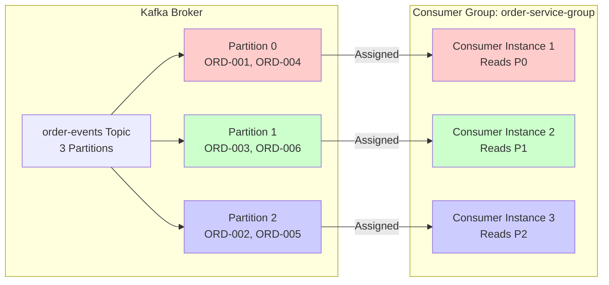
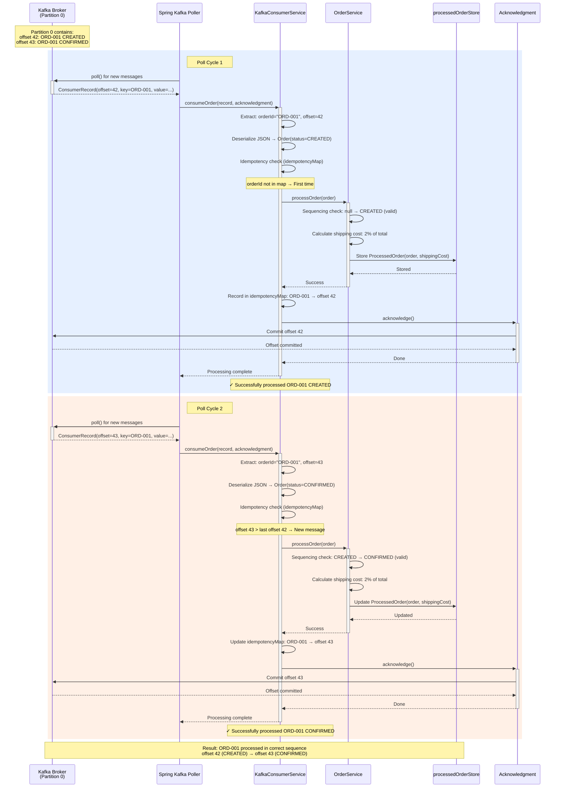

# STRUCTURE.md: Consumer Project Structure

## System Overview

The **Consumer (Order Service)** is responsible for consuming order events from Kafka topics and maintaining order state. It implements key Kafka consumer patterns to ensure **At-Least-Once delivery**, **idempotency**, and **strict sequencing** as required by Exercise 2 of the MTA Event-Driven Architecture course.

### Key Design Principles
- **Manual Offset Management**: `EnableAutoCommit = false` with `AckMode.MANUAL_IMMEDIATE`
- **At-Least-Once Delivery**: Offsets committed only after successful processing
- **Idempotency**: Duplicate message detection using offset tracking
- **Sequencing**: State machine validation enforces valid status transitions
- **Resilience**: Graceful handling of deserialization failures and connectivity issues

---

## System Flow

### Consumer Event Flow

The Order Service listens to the `order-events` Kafka topic and processes incoming order events:

#### Kafka Listener Lifecycle: From Polling to Acknowledgment

```
1. Kafka Consumer Client polls broker (auto-polling every 100ms by default)
   ├─ Consumer is assigned partitions (e.g., Consumer 1 → Partition 0)
   ├─ Fetches batch of messages from assigned partitions
   ↓
2. Spring Kafka invokes @KafkaListener method for each message
   ├─ Method: consumeOrder(ConsumerRecord, Acknowledgment)
   ├─ Extract: orderId (key), payload (value), offset, topic, partition
   ↓
3. Deserialization Layer
   ├─ Parse JSON payload → Order object
   ├─ Attach topicName metadata for historical tracking
   ├─ On failure: throw IOException → trigger retry/DLT
   ↓
4. Idempotency Check
   ├─ Query idempotencyMap: has this orderId+offset been processed?
   ├─ If YES: acknowledge and skip (duplicate from retry)
   ├─ If NO: proceed to processing
   ↓
5. Business Logic Processing (OrderService.processOrder)
   ├─ Sequencing Validation: check if status transition is valid
   │  ├─ Valid: CREATED → CONFIRMED → DISPATCHED → DELIVERED
   │  ├─ Invalid: DISPATCHED → CREATED (reject, log warning)
   ├─ Duplicate Detection: exact same Order already in state?
   │  ├─ If YES: skip (idempotent, same status)
   │  ├─ If NO: calculate shipping cost and update state
   ├─ State Update: store ProcessedOrder in processedOrderStore map
   ↓
6. Mark as Processed
   ├─ Record orderId+offset in idempotencyMap
   ├─ Timestamp: when processing completed
   ↓
7. Manual Acknowledgment
   ├─ Call: acknowledgment.acknowledge()
   ├─ Kafka commits offset immediately (MANUAL_IMMEDIATE mode)
   ├─ Consumer advances: this message won't be redelivered
   ↓
8. Success Logging
   └─ Log: "✓ Successfully processed order: orderId=..., status=..., topic=..."
```

**Error Paths:**
- **Deserialization Failure**: Exception thrown → CommonErrorHandler retries → DLT after max retries
- **Processing Exception**: Exception thrown → CommonErrorHandler retries → DLT after max retries
- **No Acknowledgment**: Offset not committed → message redelivered on consumer restart

---

### Message Processing Flow Diagram

```mermaid
flowchart TD
    Broker[Kafka Broker<br/>order-events Topic]
    
    subgraph Consumer["Order Service (Consumer)"]
        Poller[Spring Kafka<br/>Auto-Poller]
        Listener[KafkaConsumerService<br/>@KafkaListener]
        Deserialize[Deserialization<br/>JSON → Order]
        Idempotency[Idempotency Check<br/>idempotencyMap]
        OrderSvc[OrderService<br/>Business Logic]
        Sequencing[State Machine<br/>Sequencing Validation]
        Shipping[Shipping Cost<br/>Calculation]
        StateStore[ProcessedOrder Store<br/>ConcurrentHashMap]
        Ack[Manual Acknowledgment<br/>acknowledgment.acknowledge()]
    end
    
    Broker -->|Poll every 100ms| Poller
    Poller -->|ConsumerRecord| Listener
    Listener -->|payload + metadata| Deserialize
    
    Deserialize -->|Order object| Idempotency
    Deserialize -.->|IOException| ErrorHandler[Error Handler]
    
    Idempotency -->|New message| OrderSvc
    Idempotency -->|Duplicate offset| Ack
    
    OrderSvc --> Sequencing
    Sequencing -->|Valid transition| Shipping
    Sequencing -.->|Invalid transition| Log[Log Warning<br/>Skip Update]
    
    Shipping --> StateStore
    StateStore --> Ack
    
    Log --> Ack
    
    ErrorHandler -.->|Retry| Listener
    ErrorHandler -.->|Max retries exceeded| DLT[Dead Letter Topic]
    
    Ack -->|Commit offset| Broker
    
    style Listener fill:#e1f5ff
    style Idempotency fill:#ffe1f5
    style Sequencing fill:#fff4e1
    style Ack fill:#e1ffe1
    style ErrorHandler fill:#ffe1e1
```

---

## Partition Assignment and Ordering Guarantees

### How Consumers Read from Partitions



**Key Principles:**

1. **Partition Assignment**:
   - Each partition is assigned to exactly ONE consumer instance in the group
   - If 1 consumer + 3 partitions → consumer reads from all 3 partitions sequentially
   - If 3 consumers + 3 partitions → each consumer reads from 1 partition (optimal)
   - If 5 consumers + 3 partitions → 2 consumers are idle (over-provisioning)

2. **Ordering Guarantee**:
   - **Within a partition**: Messages are consumed in the exact order they were produced (FIFO)
   - **Across partitions**: No ordering guarantee (messages can be processed concurrently)
   - **For same orderId**: All events go to the same partition (via message key) → strict ordering

3. **Rebalancing**:
   - When a consumer joins/leaves, Kafka reassigns partitions
   - During rebalancing, consumption pauses briefly
   - After rebalancing, each partition still assigned to exactly one consumer

---

## Listener Lifecycle Sequence Diagram



**Key Observations:**
1. **Partition-level FIFO**: offset 42 consumed before offset 43
2. **Manual Acknowledgment**: offset committed only after state update succeeds
3. **Idempotency**: Each offset tracked to detect redeliveries
4. **Sequencing**: State machine validates CREATED → CONFIRMED transition
5. **At-Least-Once**: If consumer crashes before acknowledge(), message redelivered

---

## Directory Layout

```
consumer/
├── src/main/java/mta/eda/consumer/
│   ├── config/
│   │   └── KafkaConsumerConfig.java          # Kafka consumer factory configuration
│   │
│   ├── controller/
│   │   └── OrderController.java              # REST API endpoints (root, health, orders)
│   │
│   ├── exception/
│   │   ├── GlobalExceptionHandler.java       # Centralized exception handling (6 handlers)
│   │   ├── OrderNotFoundException.java       # Custom exception for 404 errors
│   │   └── InvalidOrderIdException.java      # Custom exception for validation errors
│   │
│   ├── model/
│   │   ├── order/
│   │   │   ├── Order.java                    # Order record (from Kafka events)
│   │   │   ├── OrderItem.java                # OrderItem record (line items)
│   │   │   └── ProcessedOrder.java           # ProcessedOrder record (Order + shipping cost)
│   │   │
│   │   ├── request/
│   │   │   ├── OrderDetailsRequest.java      # DTO with orderId validation (hex format)
│   │   │   └── AllOrdersFromTopicRequest.java # DTO with topicName validation
│   │   │
│   │   └── response/
│   │       ├── HealthCheck.java              # HealthCheck record (status + details)
│   │       └── HealthResponse.java           # HealthResponse record (comprehensive health info)
│   │
│   └── service/
│       ├── general/
│       │   └── HealthService.java            # Health check operations (reports Kafka status)
│       │
│       ├── kafka/
│       │   └── KafkaConnectivityService.java # Kafka connectivity monitoring with Resilience4j
│       │
│       ├── order/
│       │   └── OrderService.java             # Order processing logic (idempotency, sequencing, shipping)
│       │
│       └── utils/
│           └── OrderUtils.java               # Utility methods (shipping cost, orderId normalization)
│
├── src/main/resources/
│   └── application.properties                # Spring Boot configuration (Kafka, logging)
│
├── docs/
│   ├── PLAN.md                               # Implementation phases and progress
│   ├── CONFIG.md                             # Configuration options and rationale
│   ├── ERRORS.md                             # Error handling mechanisms
│   └── STRUCTURE.md                          # This file
│
├── Dockerfile                                # Multi-stage build (Maven + JRE)
├── docker-compose.yml                        # Docker orchestration (order-service only)
├── .env.example                              # Environment variables template
├── pom.xml                                   # Maven dependencies
├── HELP.md                                   # Quick reference guide
└── README.md                                 # Comprehensive documentation
```

---

## Key Files Description

### **config/KafkaConsumerConfig.java**
- Configures `ConsumerFactory` with StringDeserializers
- Sets up `ConcurrentKafkaListenerContainerFactory`
- Enables **MANUAL_IMMEDIATE** acknowledgment mode
- **autoStartup=false** - Allows Consumer to run without Kafka (standalone mode)
- Provides `ObjectMapper` bean for JSON deserialization

### **exception/GlobalExceptionHandler.java**
Centralized exception handler for all API errors with consistent error responses:

**6 Exception Handlers:**
1. `MethodArgumentNotValidException` → HTTP 400 (validation errors, field errors)
2. `HttpMessageNotReadableException` → HTTP 400 (malformed JSON)
3. `InvalidOrderIdException` → HTTP 400 (custom exception, orderId validation)
4. `IllegalArgumentException` → HTTP 400 (OrderUtils validation failures)
5. `OrderNotFoundException` → HTTP 404 (order not found in state store)
6. `Exception` (catch-all) → HTTP 500 (unhandled exceptions, stack trace logged)

**Logging Levels:**
- WARN for 400 errors (client's fault)
- INFO for 404 errors (expected, not found)
- ERROR for 500 errors (with full stack trace)

### **exception/OrderNotFoundException.java**
Custom exception thrown when order not found:
```java
public class OrderNotFoundException extends RuntimeException {
    private final String orderId;
    public String getOrderId() { ... }
}
```

### **exception/InvalidOrderIdException.java**
Custom exception for invalid orderId format:
```java
public class InvalidOrderIdException extends RuntimeException {
    private final String orderId;
    public String getOrderId() { ... }
}
```
- **Root Endpoint** (GET /order-service/): Service metadata with structured endpoints
- **Live Probe** (GET /order-service/health/live): Liveness check via HealthService
- **Ready Probe** (GET /order-service/health/ready): Readiness check with Kafka connectivity
- **Order Details** (POST /order-service/order-details): Get order by ID with validation
- **All Orders** (POST /order-service/getAllOrdersFromTopic): Diagnostic endpoint

All endpoints use dependency injection of `OrderService` and `HealthService`.

### **model/order/Order.java**
Record representing an order event from Kafka:
```java
public record Order(
    String orderId,
    String customerId,
    LocalDateTime orderDate,
    List<OrderItem> items,
    double totalAmount,
    String currency,
    String status
) {}
```

### **model/order/ProcessedOrder.java**
Record wrapping Order with calculated shipping cost:
```java
public record ProcessedOrder(
    Order order,
    double shippingCost
) {}
```
Uses **composition pattern** (not inheritance) to keep Order immutable.

### **model/request/OrderDetailsRequest.java**
DTO with comprehensive orderId validation:
- `@NotBlank` - Ensures orderId is not empty
- `@Pattern(regexp = "^[0-9A-Fa-f]+$")` - Validates hexadecimal format
- `@JsonProperty("orderId")` - Explicit JSON mapping

### **model/response/HealthResponse.java**
Comprehensive health response record:
```java
public record HealthResponse(
    String serviceName,
    String type,           // "liveness" or "readiness"
    String status,         // "UP" or "DOWN"
    String timestamp,      // ISO-8601 format
    Map<String, HealthCheck> checks
) {}
```

### **service/general/HealthService.java**
Health check service reporting system status:
- `getServiceStatus()` - Service responsiveness (always UP if callable)
- `getKafkaStatus()` - Kafka connectivity status (cached from KafkaConnectivityService)
- `getLocalStateStatus()` - Local state store accessibility

**Key Feature:** Returns instant responses using cached state (no blocking)

### **service/kafka/KafkaConnectivityService.java**
Asynchronous Kafka connectivity management with Resilience4j:
- `monitorKafkaAsync()` - Background monitoring loop (async, non-blocking)
- `connectAndManageListeners()` - Connection management with exponential backoff
- `testKafkaConnection()` - Kafka broker connectivity test (3s timeout)
- `startKafkaListeners()` - Interrupt-safe listener startup
- `stopKafkaListeners()` - Interrupt-safe listener shutdown
- `isKafkaConnected()` - Returns cached connection state

**Features:**
- Uses Resilience4j Retry for exponential backoff (2s → 4s → 8s ... → 60s max)
- Infinite retries (never gives up)
- Automatic listener restart when Kafka becomes available
- Thread-safe state management with AtomicBoolean
- Async processing via @EnableAsync

### **service/order/OrderService.java**
Core event processing logic:
- **Idempotency Check** - Detects duplicate events
- **Sequencing Validation** - Enforces state machine (CREATED → CONFIRMED → DISPATCHED → DELIVERED)
- **Shipping Cost Calculation** - Business logic: 2% of total amount
- **State Management** - Maintains `processedOrderStore` map
- **Error Handling** - Logs invalid transitions

### **service/utils/OrderUtils.java**
Utility methods for order processing:
- `calculateShippingCost(Order)` - Returns 2% of order total amount
- `normalizeOrderId(String)` - Adds ORD- prefix and pads to 4 hex digits

---

## Package Organization

| Package | Purpose | Responsibility |
|---------|---------|-----------------|
| **config** | Configuration | Bean setup, Kafka factory, autoStartup control |
| **controller** | API Layer | HTTP endpoints, request/response handling |
| **exception** | Error Handling | GlobalExceptionHandler, custom exceptions |
| **model.order** | Domain Objects | Order entities (records) |
| **model.request** | Input DTOs | Request validation |
| **model.response** | Output DTOs | Response objects |
| **service.general** | Cross-cutting | Health checks (status reporting) |
| **service.kafka** | Kafka Integration | Connectivity monitoring, listener management |
| **service.order** | Business Logic | Processing, validation, state management |
| **service.utils** | Utilities | Shipping cost calculation, orderId normalization |

---

## Data Flow

```
Kafka Topic (orders)
    ↓
KafkaConsumerService.listen()
    ├─ Receive ConsumerRecord<String, String>
    ├─ Deserialize JSON → Order object
    ├─ Validate message key
    ↓
OrderService.processOrder(Order)
    ├─ Check Idempotency (exact duplicate?)
    ├─ Check Sequencing (valid transition?)
    ├─ Calculate Shipping Cost
    ├─ Update State (ProcessedOrder)
    ↓
acknowledgment.acknowledge()
    ↓
Kafka Offset Committed
```

---

## Interaction Diagram

```
Client Request
    ↓
OrderController
    ├─ Injects: OrderService, HealthService
    ├─ Validates: Request DTOs (@NotBlank, @Pattern)
    ↓
OrderService / HealthService
    ├─ Retrieves: ProcessedOrder, HealthStatus
    ↓
Response DTO (HealthResponse, Map)
    ↓
Client Response (JSON)
```

---

## Design Patterns Used

1. **Composition** - ProcessedOrder wraps Order (not inheritance)
2. **Dependency Injection** - Spring @Autowired in controllers and services
3. **DTO Pattern** - Request/Response records for data transfer
4. **Service Layer** - Business logic isolated in services
5. **State Machine** - Sequencing validation for order status
6. **Error Handling** - Try-catch with comprehensive logging
7. **Kafka Manual Acknowledgment** - Ensures At-Least-Once delivery

