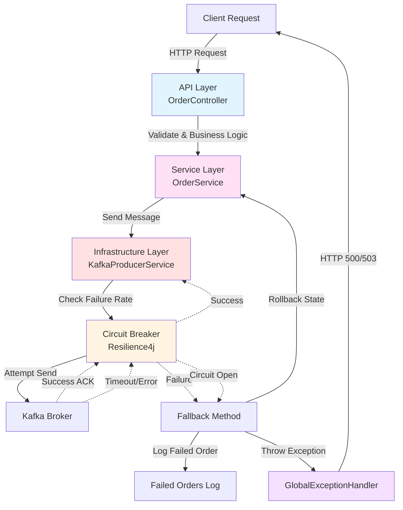
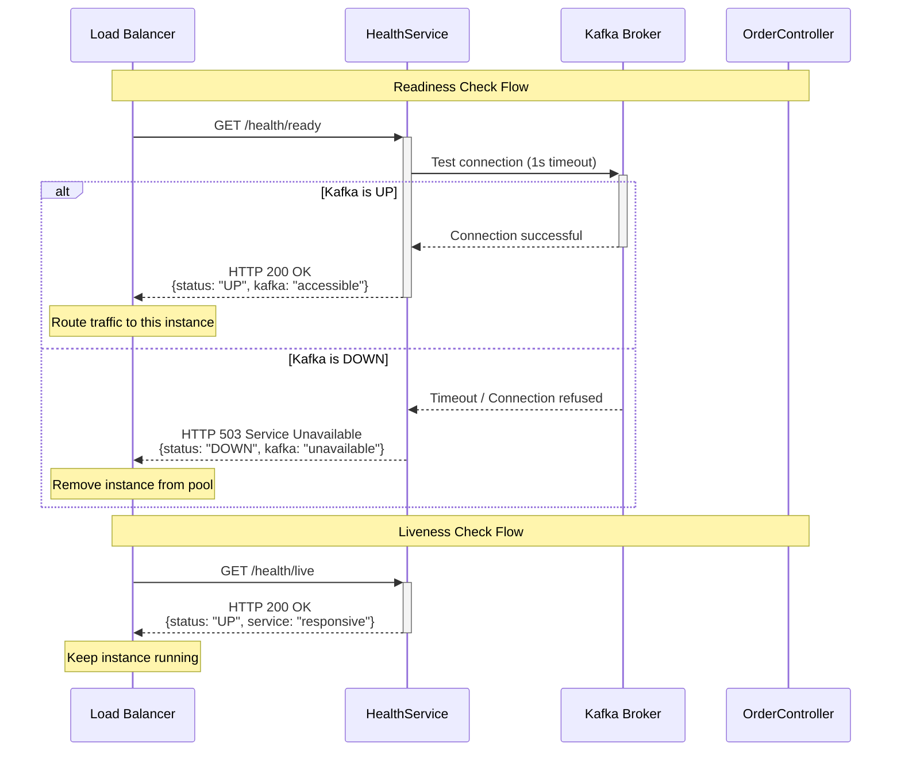
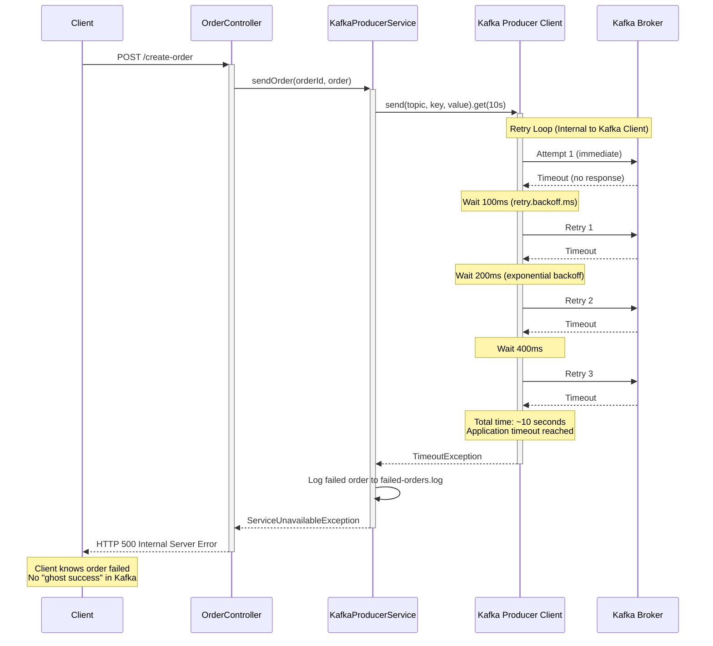
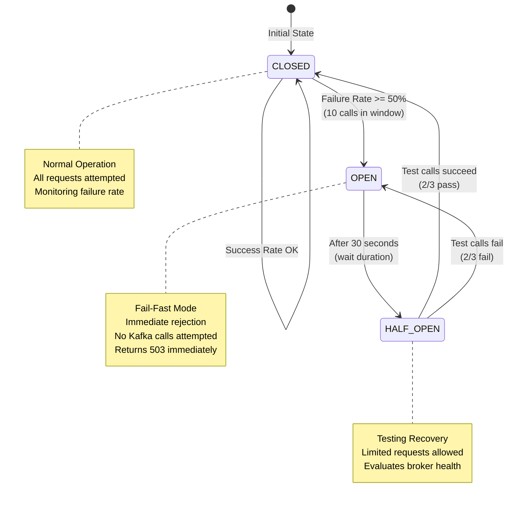
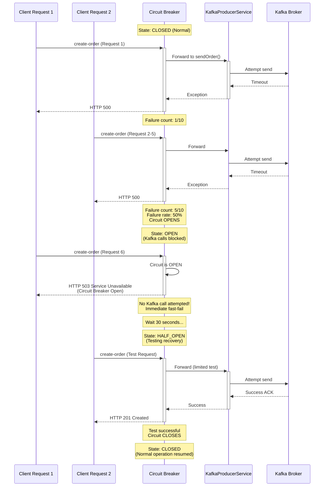

# Error Handling Strategy

The Producer (Cart Service) implements a layered error handling strategy across the **API Layer**, **Service Layer**, and **Infrastructure Layer** to ensure reliability and data integrity.

**Course Context**: This error handling strategy aligns with **Session 8 - Error Handling & Resilience** from the MTA Event-Driven Architecture course, implementing patterns for broker connectivity issues, retry logic, and data safety.

---

## Error Handling Architecture Overview



---

## 1. Infrastructure & Kafka Errors (The "Active" Layer)

These errors involve connection to the broker and message delivery. The system handles them through a multi-stage recovery process.

### Kafka Connectivity Monitoring

**HealthService Implementation:**

The Producer implements proactive Kafka connectivity monitoring through health check endpoints:

- **Readiness Probe** (`GET /cart-service/health/ready`):
  - Checks Kafka broker connectivity before accepting traffic
  - Tests topic existence and accessibility
  - Returns **503 Service Unavailable** if Kafka is unreachable
  - Used by load balancers/Kubernetes to route traffic only to healthy instances

- **Liveness Probe** (`GET /cart-service/health/live`):
  - Checks internal service health (JVM responsiveness)
  - Always returns **200 OK** if service process is running
  - Does not depend on Kafka availability

**Health Check Flow:**



**API Response Codes When Kafka is Unreachable:**

1. **Health Endpoint**: Returns **503 Service Unavailable**
   - Indicates service is alive but not ready to handle requests
   - Load balancer stops routing traffic to this instance
   
2. **Order Creation/Update Endpoints**: Return **500 Internal Server Error** or **503 Service Unavailable**
   - **500**: Kafka timeout after exhausting retries (unexpected server condition)
   - **503**: Circuit Breaker open (service protecting itself from cascade failure)
   - Client should implement retry logic with exponential backoff

---

### Level 1: Synchronous Online Retry (Response Accuracy)

**Implementation**: Kafka Producer Client with Internal Retries

- **Action**: The producer is configured for **continuous retries** (MAX_INT retries) within an **8-second delivery window** (`delivery.timeout.ms=8000`).
- **Per-Attempt Timeout**: Each individual request attempt times out after **3 seconds** (`request.timeout.ms=3000`).
- **Application Timeout**: API blocks for **10 seconds** (`producer.send.timeout.ms=10000`).
- **Goal**: Ensure that if a user receives a failure response (after the 10s API timeout), the Kafka client has **already stopped** trying to send the message (at 8s). This prevents "Ghost Successes" where an order lands in Kafka after the user was told it failed.
- **API Response**: 
  - Returns **500 Internal Server Error** if Kafka send fails (ServiceUnavailableException)
  - Returns **503 Service Unavailable** if Circuit Breaker is open (CallNotPermittedException)
- **Architectural Reasoning**: 500 indicates an unexpected server error during the send operation; 503 indicates the service is protecting itself from cascade failures.

**Retry Flow:**



**Exponential Backoff Schedule:**
```
Attempt 1:  0ms    (immediate)
Retry 1:    100ms
Retry 2:    200ms  (100 * 2^1)
Retry 3:    400ms  (100 * 2^2)
Retry 4:    800ms
Retry 5:    1.6s
Retry 6:    3.2s
(continues until 8s delivery timeout)

Total retry window: ~8 seconds
Application timeout: 10 seconds (prevents ghost successes)
Max delivery timeout: 8 seconds (Kafka stops before API timeout)
```

**Why This Works:**
- Delivery timeout (8s) < Application timeout (10s)
- If application timeout fires, Kafka client has already stopped retrying
- No message arrives in Kafka after client receives error response
- Guarantees client knows the outcome: either success or definitive failure

---
### Level 2: Circuit Breaker (Fail-Fast Mechanism)

**Implementation**: Resilience4j Circuit Breaker

- **Action**: Protected by **Resilience4j**, the system monitors the failure rate of Kafka calls.
- **Tripping the Circuit**: If **50% of calls fail** within a sliding window of 10 attempts, the circuit opens for **30 seconds**.
- **Behavior**: When the circuit is **OPEN**, the system immediately rejects new Kafka calls without attempting them, protecting application threads from exhaustion.
- **API Response**: Returns **503 Service Unavailable**. 
- **Architectural Reasoning**: 503 indicates a temporary state where the service is protecting itself.

**Circuit Breaker States:**



**Circuit Breaker Flow:**



**Configuration:**
```properties
resilience4j.circuitbreaker.instances.cartService.failure-rate-threshold=50
resilience4j.circuitbreaker.instances.cartService.sliding-window-size=10
resilience4j.circuitbreaker.instances.cartService.wait-duration-in-open-state=30s
resilience4j.circuitbreaker.instances.cartService.permitted-number-of-calls-in-half-open-state=3
resilience4j.circuitbreaker.instances.cartService.sliding-window-type=COUNT_BASED
```

**Benefits:**
- ✅ Protects application threads from hanging on unavailable Kafka broker
- ✅ Fast-fail reduces client wait time (immediate 503 vs 10s timeout)
- ✅ Automatic recovery testing (half-open state)
- ✅ Prevents cascade failures to upstream services

---
### Level 3: Data Safety (Multiple Fallback Mechanisms)

The system implements **two complementary fallback mechanisms** to ensure no order data is lost even during infrastructure failures:

#### 3a: Kafka DLQ Topic (Primary Fallback)
- **Mechanism**: Failed messages are sent to the `orders-dlq` Kafka topic (if Kafka is operational)
- **Implementation**: `KafkaProducerService.sendToDlq()` method
- **Trigger**: When message delivery fails after timeout or Circuit Breaker opens
- **Topic Details**:
  ```properties
  Topic Name: orders-dlq
  Partitions: 3 (same as main topic for potential replay with ordering preserved)
  Retention: 7 days (allows time for manual investigation)
  Key: orderId (preserved from original message for traceability)
  ```
- **Message Content**:
  - Raw order JSON (preserved as-is)
  - Metadata headers: original-topic, error-reason, failed-at
  - Async callback logs success/failure
- **Goal**: Enable DevOps team to investigate failures and manually replay orders once infrastructure is restored
- **Recovery Process**:
  1. Monitor `orders-dlq` for failed messages
  2. Analyze error reasons and root cause
  3. Fix underlying issue (restore Kafka, fix network, etc.)
  4. Replay messages from DLQ back to `orders` topic

#### 3b: File-Based Fallback (Infrastructure Failure Protection)
- **Action**: If the timeout is reached OR the Circuit Breaker is open AND Kafka/DLQ send fails, the system logs the **full order details** to a dedicated `failed-orders.log` file.
- **Implementation**: A dedicated logger (`FAILED_ORDERS_LOGGER`) captures the order payload and failure reason.
- **Rationale**: This protects against the scenario where Kafka itself is completely down/unreachable, making the DLQ topic inaccessible.
- **Log Format**:
  ```
  FAILED_ORDER | Type: KAFKA_DOWN | OrderId: ORD-123456 | Reason: Broker unreachable | Payload: {...}
  ```
- **Location**: `producer/logs/failed-orders.log`
- **Retention**: Persistent (until manually archived)
- **Goal**: Ensure no customer data is lost even if entire Kafka cluster fails

**Fallback Strategy Flowchart:**
```
Order Send Attempt
  ├─ SUCCESS ✓
  │  └─ Order delivered to 'orders' topic
  │
  └─ FAILURE ✗
     ├─ DLQ Send Attempt (to 'orders-dlq' topic)
     │  ├─ SUCCESS ✓
     │  │  └─ Message stored in DLQ for manual replay
     │  │     (Kafka is operational but order delivery failed)
     │  │
     │  └─ FAILURE ✗
     │     └─ File-Based Fallback (to 'failed-orders.log')
     │        └─ Message logged to file
     │           (Kafka infrastructure is down, no DLQ available)
```

**When Each Mechanism is Used:**
| Scenario | Primary Fallback | Secondary Fallback |
|----------|------------------|-------------------|
| Order delivery fails, Kafka OK | ✅ DLQ Topic (orders-dlq) | N/A |
| Kafka broker down | ❌ DLQ unavailable | ✅ File Log (failed-orders.log) |
| Network partition | ❌ DLQ unreachable | ✅ File Log (failed-orders.log) |
| DLQ send fails | ❌ DLQ send error | ✅ File Log (failed-orders.log) |

---

### Topic Not Found Error (TOPIC_NOT_FOUND)

**Scenario**: The configured Kafka topic does not exist and auto-topic creation is disabled.

**Detection**:
- The `KafkaConnectivityService` uses a **two-pass approach** to accurately distinguish between Kafka being down vs. topic not found
- This detection happens in two places:
  1. **Health Check**: Background monitoring continuously checks topic existence
  2. **Producer Send**: When sending a message fails due to missing topic

**Implementation** (Two-Pass Detection):
```java
// KafkaConnectivityService.java
public boolean isTopicNotFoundException(Throwable e) {
    // FIRST PASS: Rule out connection/timeout issues (these are NOT topic issues)
    Throwable cause = e;
    while (cause != null) {
        // Connection/timeout exceptions indicate Kafka is down, not a topic issue
        if (cause instanceof java.util.concurrent.TimeoutException ||
            cause instanceof java.io.IOException ||
            cause instanceof org.apache.kafka.common.errors.TimeoutException) {
            String message = cause.getMessage();
            // If message indicates connection/timeout, this is NOT a topic issue
            if (message != null && (
                message.contains("timed out") ||
                message.contains("Connection refused") ||
                message.contains("Failed to update metadata") ||
                message.contains("broker") ||
                message.contains("not available"))) {
                return false;  // This is KAFKA_DOWN, not TOPIC_NOT_FOUND
            }
        }
        cause = cause.getCause();
    }
    
    // SECOND PASS: Check for actual topic-not-found exceptions
    cause = e;
    while (cause != null) {
        if (cause instanceof UnknownTopicOrPartitionException) {
            return true;
        }
        // Only check for very specific topic-related error messages
        String message = cause.getMessage();
        if (message != null && message.contains("UnknownTopicOrPartition")) {
            return true;
        }
        cause = cause.getCause();
    }
    return false;
}
```

**Why Two-Pass Approach?**
- **Problem**: Metadata-related errors can occur when either Kafka is down OR topic doesn't exist
- **Solution**: First eliminate connection issues, then check for topic-specific problems
- **Result**: Accurate error type reporting (KAFKA_DOWN vs TOPIC_NOT_FOUND)

**Health Check Integration**:
The `/health/ready` endpoint will return:
```json
{
  "name": "Producer (Cart Service)",
  "type": "readiness",
  "status": "DOWN",
  "timestamp": "2026-01-03T12:34:56.789Z",
  "checks": {
    "service": {
      "status": "UP",
      "details": "Cart Service is running and responsive"
    },
    "kafka": {
      "status": "DOWN",
      "details": "Topic 'orders' does not exist"
    }
  }
}
```
HTTP Status: **503 Service Unavailable**

**API Response (during order creation/update)**:
- **Status**: `500 Internal Server Error`
- **Error Type**: `TOPIC_NOT_FOUND`
- **Response Body**:
```json
{
  "timestamp": "2026-01-03T12:34:56.789Z",
  "error": "Internal Server Error",
  "message": "The configured Kafka topic does not exist.",
  "path": "/cart-service/create-order",
  "details": {
    "type": "TOPIC_NOT_FOUND",
    "orderId": "ORD-ABC123",
    "topicName": "orders"
  }
}
```

**Architectural Reasoning**:
- This is a **configuration error** that prevents message delivery
- Returns 500 because it's a server-side misconfiguration, not a temporary outage
- **Different from**:
  - `KAFKA_DOWN`: Broker is unreachable (connection/timeout errors) → temporary infrastructure issue
  - `TOPIC_NOT_FOUND`: Broker is reachable but topic doesn't exist → configuration issue
  - `CIRCUIT_BREAKER_OPEN`: Temporary protection mechanism → resilience pattern
- The **two-pass detection** ensures accurate classification:
  1. First checks if it's a connection issue (KAFKA_DOWN)
  2. Only then checks if it's a topic issue (TOPIC_NOT_FOUND)
- Detected by `KafkaConnectivityService` which continuously monitors topic availability

**Resolution**:
1. Create the missing topic manually:
   ```bash
   docker exec kafka kafka-topics --bootstrap-server localhost:9092 \
     --create --topic orders --partitions 3 --replication-factor 1
   ```
2. The `KafkaConnectivityService` will automatically detect the topic once created and update the health status

**Monitoring**:
- The service continuously monitors topic availability with exponential backoff
- Health endpoints reflect real-time topic status
- Check `/cart-service/health/ready` to verify topic is available

**Testing**:
Use the provided test script: `./scripts/test-missing-topic.sh`

---

## 1.5. API Response Behavior During Kafka Connection Issues

This section clarifies how the Producer API responds when Kafka experiences connectivity problems.

### Key Principle: Producer is Write-Only (Direct Kafka Dependency)

**Important**: Unlike the Consumer, the Producer **MUST send messages to Kafka** for every order creation/update request. Therefore, **Kafka connection issues DIRECTLY affect API responses**.

### POST/PUT Endpoint Behavior (Order Creation/Update)

#### When Kafka is UP ✅

```
POST /cart-service/create-order with Order JSON
    ↓
OrderController validates request
    ↓
OrderService stores in local orderStore
    ↓
KafkaProducerService sends to orders topic
    ↓
Kafka broker acknowledges (acks=all)
    ↓
HTTP 201 Created
{
  "orderId": "ORD-123",
  "status": "PENDING",
  "numItems": 3,
  "totalAmount": 99.99
}
```

#### When Kafka is DOWN ❌ (Within 10s timeout)

```
POST /cart-service/create-order with Order JSON
    ↓
OrderController validates request
    ↓
OrderService stores in local orderStore
    ↓
KafkaProducerService attempts send
    ↓
Producer client retries for ~8 seconds (1s, 2s, 4s... exponential backoff)
    ↓
Delivery timeout (8s) reached
    ↓
Order rolled back from local store
    ↓
DLQ Topic attempted OR file log fallback
    ↓
HTTP 500 Internal Server Error
{
  "timestamp": "2026-01-04T12:00:00.000Z",
  "error": "Internal Server Error",
  "message": "The server encountered an error while publishing the order event.",
  "path": "/cart-service/create-order",
  "details": {
    "type": "KAFKA_DOWN",
    "orderId": "ORD-123"
  }
}

⚠️ CRITICAL: Order rolled back locally!
Local state does NOT reflect the failed order.
Safe to retry.
```

#### When Circuit Breaker is OPEN (50% failure rate)

```
POST /cart-service/create-order with Order JSON
    ↓
OrderController validates request
    ↓
OrderService stores in local orderStore
    ↓
Circuit Breaker checks state
    ↓
Circuit is OPEN (protecting from cascade failure)
    ↓
Order rolled back from local store
    ↓
HTTP 503 Service Unavailable
{
  "timestamp": "2026-01-04T12:00:00.000Z",
  "error": "Service Unavailable",
  "message": "The service is temporarily unavailable due to high failure rates. Please try again later.",
  "path": "/cart-service/create-order",
  "details": {
    "type": "CIRCUIT_BREAKER_OPEN"
  }
}

⚠️ PROTECTION ACTIVE: Service protecting itself!
Order rolled back locally.
Retry after ~30 seconds (wait-duration-in-open-state).
```

### GET Endpoint Behavior (Order Details)

#### When Kafka is UP ✅

```
GET /cart-service/order-details/ORD-123
    ↓
OrderController retrieves from local orderStore
    ↓
HTTP 200 OK
{
  "orderId": "ORD-123",
  "status": "PENDING",
  "numItems": 3,
  "totalAmount": 99.99
}
```

#### When Kafka is DOWN ❌ (But Producer App Running)

```
GET /cart-service/order-details/ORD-123
    ↓
OrderController retrieves from local orderStore
    ↓
HTTP 200 OK with order details
{
  "orderId": "ORD-123",
  "status": "PENDING",
  "numItems": 3,
  "totalAmount": 99.99
}

✅ GET still works! (reads from local store)
⚠️ But POST/PUT will fail (can't reach Kafka)
```

### Health Check Endpoints (Readiness/Liveness)

#### Readiness Probe: `/health/ready`

**When Kafka is UP ✅**:
```bash
curl http://localhost:8081/health/ready
```

Response:
```json
HTTP 200 OK
{
  "status": "UP",
  "components": {
    "kafkaHealthIndicator": {
      "status": "UP",
      "details": {
        "brokers": "1",
        "topics": "1",
        "ordersTopicReady": true
      }
    }
  }
}
```

**When Kafka is DOWN ❌**:
```bash
curl http://localhost:8081/health/ready
```

Response:
```json
HTTP 503 Service Unavailable
{
  "status": "DOWN",
  "components": {
    "kafkaHealthIndicator": {
      "status": "DOWN",
      "details": {
        "error": "Cannot connect to Kafka broker at kafka:29092",
        "brokers": "0",
        "topics": "0"
      }
    }
  }
}
```

#### Liveness Probe: `/health/live`

**When Kafka is UP ✅**:
```bash
curl http://localhost:8081/health/live
```

Response:
```json
HTTP 200 OK
{
  "status": "UP",
  "components": {
    "livenessState": {
      "status": "UP",
      "state": "CORRECT"
    }
  }
}
```

**When Kafka is DOWN ❌** (Producer app still running):
```bash
curl http://localhost:8081/health/live
```

Response:
```json
HTTP 200 OK ← App is still alive!
{
  "status": "UP",
  "components": {
    "livenessState": {
      "status": "UP",
      "state": "CORRECT"
    }
  }
}
```

**Difference**: Liveness doesn't care about Kafka connectivity. It only checks if the JVM is responsive.

### API Response Summary for Connection Issues

| Scenario | POST/PUT (Create/Update) | GET (Read) | Readiness | Liveness |
|----------|:----------------------:|:----------:|:---------:|:--------:|
| **Kafka UP** | ✅ 201 Created | ✅ 200 OK | ✅ 200 OK | ✅ 200 OK |
| **Kafka DOWN** | ❌ 500 Error | ✅ 200 OK | ❌ 503 | ✅ 200 OK |
| **Circuit Open** | ❌ 503 Error | ✅ 200 OK | ❌ 503 | ✅ 200 OK |
| **App Crashed** | ❌ Refused | ❌ Refused | ❌ Refused | ❌ Refused |

### Handling Kafka Downtime (Producer Perspective)

**Problem**: POST/PUT requests fail while GET requests still work (reading stale data from local store).

**Solutions**:

1. **Use Readiness Check** (Recommended):
   - Load balancer checks `/health/ready`
   - If returns 503, removes producer from traffic
   - Clients routed away before attempting POST/PUT

2. **Implement Retry Logic**:
   - Client catches HTTP 500/503
   - Implements exponential backoff
   - Retries after 2-4 seconds
   - Gives Kafka time to recover

3. **Monitor Readiness Status**:
   - Alert if readiness returns 503
   - Indicates Kafka connectivity issue
   - Triggers incident response

4. **Check Local State Consistency**:
   - Order is rolled back on failure
   - Local store reflects actual state
   - Safe to retry failed requests

### Key Guarantees for Producer API

✅ **No Ghost Orders**: If client receives error (500/503), order is NOT in Kafka
- Application timeout (10s) > Kafka delivery timeout (8s)
- Kafka stops retrying before API returns error

✅ **State Consistency**: Local orderStore matches API response
- Failed orders are rolled back
- Successful orders remain in store
- Client can safely retry on error

✅ **Health Visibility**: Readiness endpoint reveals Kafka status
- 200 = Ready to accept requests
- 503 = Not ready (Kafka down or circuit open)
- Load balancer can route accordingly

### Recovery Process

**When Kafka Goes Down**:
```
1. POST/PUT requests fail (HTTP 500/503)
2. Local orders are rolled back
3. Health endpoint returns 503
4. Load balancer removes from traffic
5. Orders in DLQ or failed-orders.log

When Kafka Comes Back Up:
1. KafkaConnectivityService detects recovery
2. Health endpoint returns 200
3. Load balancer re-adds to traffic
4. Circuit breaker closes (testing recovery)
5. POST/PUT requests work again
6. DLQ/failed orders can be replayed
```

---

## 2. Resiliency & Consistency Patterns

To ensure the Producer remains a "source of truth," we implement advanced patterns in the `OrderService`.

### Local Store Consistency (Save-with-Rollback)
- **Responsiveness**: We use a 10s synchronous API timeout (`producer.send.timeout.ms`) to ensure the application remains responsive even during broker outages.
- **Rollback Logic**: If Kafka fails after the timeout or due to an open circuit, we revert the in-memory `orderStore`:
    - **Create**: The failed order is **removed** from the store.
    - **Update**: The **previous version** of the order is restored.
- **Consistency Guarantee**: This ensures the local state doesn't "lie" to the user. If the client receives a 500 or 503 error, they can safely retry the request knowing the system state has been reverted to its pre-failure condition.

### Internal Dead Letter Storage (DLQ)
- **Corrective Action**: Failed messages are added to an in-memory `failedMessages` map (keyed by `orderId`).
- **Deduplication**: Using a map ensures that only the **latest intended state** of a failed order is preserved for recovery.
- **Data Preservation**: This follows the "Saving for Later Processing" approach to ensure no order data is lost even if the infrastructure is down.

---

## 3. Business Logic Errors

Handled at the service level before any message is sent to Kafka.

- **Order Existence Check**:
    - **Errors**: `OrderNotFoundException` (during update) or `DuplicateOrderException` (during creation).
    - **Handling**: Caught by `GlobalExceptionHandler`, returning **404 Not Found** or **409 Conflict**.
- **Recovery**: No resending occurs here as these are logical errors; the client must correct the request data.

---

## 5. Kafka Connection Error (KAFKA_DOWN)

**Scenario**: The Kafka broker is unreachable due to network issues, Kafka being stopped, or connection timeouts.

**Detection**:
- Connection/timeout exceptions: `TimeoutException`, `IOException`, connection refused errors
- The `KafkaConnectivityService` distinguishes this from `TOPIC_NOT_FOUND` using the two-pass approach
- Background monitoring continuously attempts reconnection with exponential backoff

**API Response (during order creation/update)**:
- **Status**: `500 Internal Server Error`
- **Error Type**: `KAFKA_DOWN`
- **Response Body**:
```json
{
  "timestamp": "2026-01-04T12:34:56.789Z",
  "error": "Internal Server Error",
  "message": "The server encountered an error while publishing the order event.",
  "path": "/cart-service/create-order",
  "details": {
    "type": "KAFKA_DOWN",
    "orderId": "ORD-ABC123"
  }
}
```

**Health Check Response**:
The `/health/ready` endpoint will return:
```json
{
  "name": "Producer (Cart Service)",
  "type": "readiness",
  "status": "DOWN",
  "timestamp": "2026-01-04T12:34:56.789Z",
  "checks": {
    "service": {
      "status": "UP",
      "details": "Cart Service is running and responsive"
    },
    "kafka": {
      "status": "DOWN",
      "details": "Cannot connect to Kafka broker at kafka:29092"
    }
  }
}
```
HTTP Status: **503 Service Unavailable**

**Architectural Reasoning**:
- This is a **temporary infrastructure issue**, not a configuration error
- Returns **500 Internal Server Error** because the send operation failed unexpectedly during request processing
- Thrown as `ServiceUnavailableException` with type `KAFKA_DOWN`
- **Circuit Breaker Integration**: After repeated failures (50% failure rate), circuit breaker opens
  - Circuit open state throws `CallNotPermittedException` → returns **503 Service Unavailable** with type `CIRCUIT_BREAKER_OPEN`
- **Auto-Recovery**: Background monitoring continuously retries with exponential backoff
- Once Kafka is restored, service automatically recovers without restart

**Resolution**:
1. Check Kafka service status:
   ```bash
   docker-compose ps kafka
   docker-compose logs kafka
   ```
2. Restart Kafka if needed:
   ```bash
   docker-compose up -d kafka
   ```
3. The `KafkaConnectivityService` will automatically detect when Kafka is back and update health status
4. Circuit breaker will close once successful sends resume

**Monitoring**:
- Check `/cart-service/health/ready` to verify Kafka connectivity
- Watch for circuit breaker state (OPEN → HALF_OPEN → CLOSED)
- Background monitoring provides automatic recovery

---

## 6. Validation & Syntax Errors

Represent malformed data from the client.

- **Action**: Handled by Spring Bean Validation and the `GlobalExceptionHandler`.
- **Response**: Returns **400 Bad Request** with field-level details (e.g., "numItems is required").
- **Recovery**: The system rejects the request immediately to prevent "poison pill" messages from entering the Kafka stream.

---

## 7. System Health & Proactivity

The system includes proactive monitoring to prevent failures before they occur.

- **Readiness Probes**: The `/health/ready` endpoint actively checks connectivity to Kafka and topic existence.
- **Action**: If the broker is down, the probe returns **503 Service Unavailable**. This allows external load balancers (or Kubernetes) to stop sending traffic to this instance before an actual order fails.
- **Liveness Probes**: The `/health/live` endpoint checks the service's internal state, ensuring the JVM is healthy.

---

## Error Response Examples

### 400 Validation
```json
{
  "timestamp": "2026-01-01T12:00:00.000Z",
  "error": "Bad Request",
  "message": "Validation error",
  "path": "/cart-service/create-order",
  "details": {
    "fieldErrors": {
      "numItems": "must be greater than or equal to 1"
    }
  }
}
```

### 500 Internal Server Error (Kafka Down)
```json
{
  "timestamp": "2026-01-04T12:00:00.000Z",
  "error": "Internal Server Error",
  "message": "The server encountered an error while publishing the order event.",
  "path": "/cart-service/create-order",
  "details": {
    "type": "KAFKA_DOWN",
    "orderId": "ORD-000A"
  }
}
```

### 500 Internal Server Error (Topic Not Found)
```json
{
  "timestamp": "2026-01-01T12:00:00.000Z",
  "error": "Internal Server Error",
  "message": "The configured Kafka topic does not exist and auto-creation is disabled.",
  "path": "/cart-service/create-order",
  "details": {
    "type": "TOPIC_NOT_FOUND",
    "orderId": "ORD-000A",
    "topicName": "orders"
  }
}
```

### 503 Service Unavailable (Circuit Breaker Open)
```json
{
  "timestamp": "2026-01-01T12:00:00.000Z",
  "error": "Service Unavailable",
  "message": "The service is temporarily unavailable due to high failure rates. Please try again later.",
  "path": "/cart-service/create-order",
  "details": {
    "type": "CIRCUIT_BREAKER_OPEN"
  }
}
```
