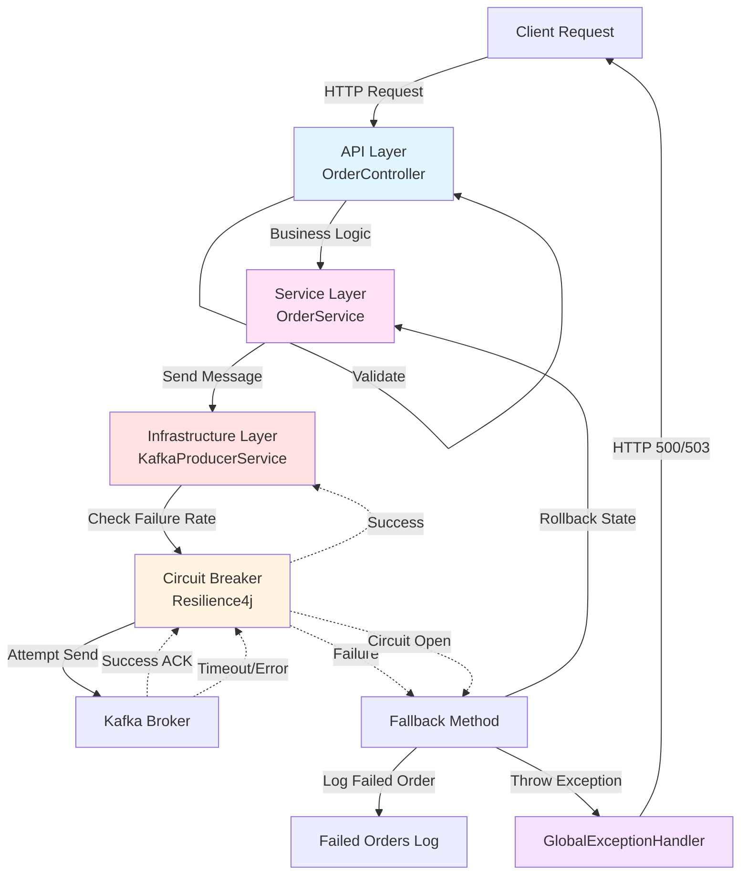
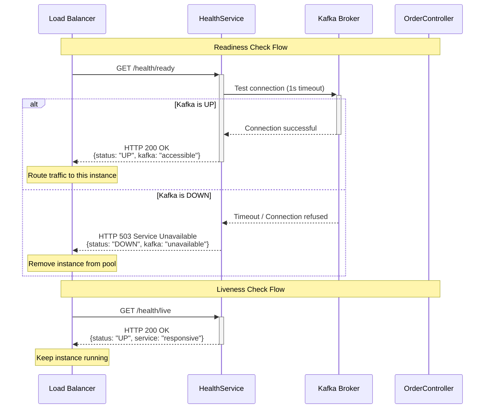
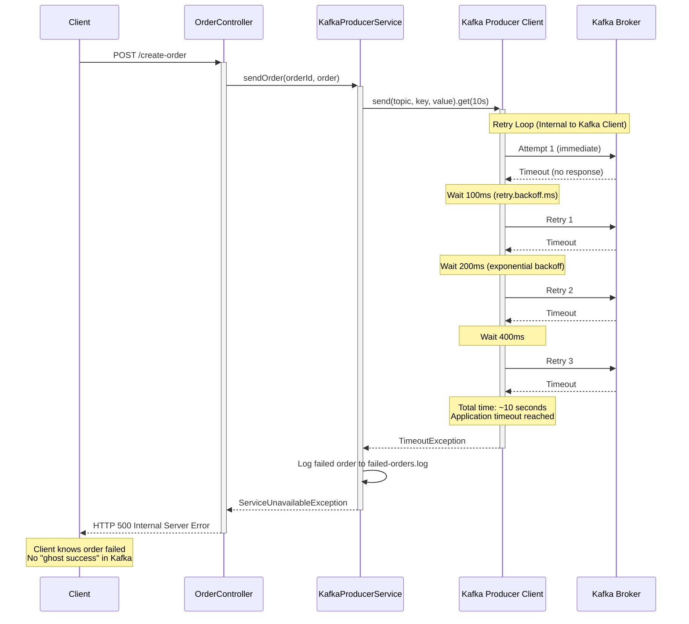
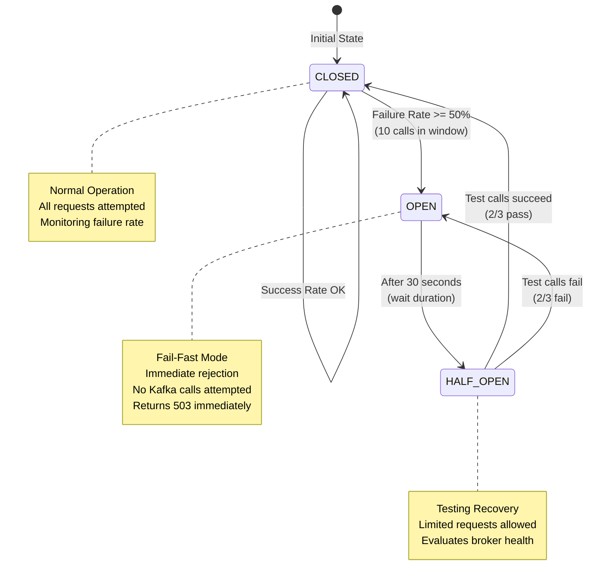
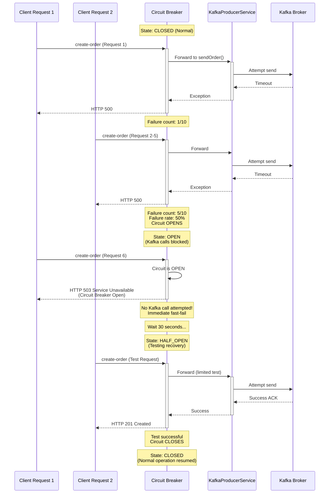

# Error Handling Strategy

The Producer (Cart Service) implements a layered error handling strategy across the **API Layer**, **Service Layer**, and **Infrastructure Layer** to ensure reliability and data integrity.

**Course Context**: This error handling strategy aligns with **Session 8 - Error Handling & Resilience** from the MTA Event-Driven Architecture course, implementing patterns for broker connectivity issues, retry logic, and data safety.

---

## Error Handling Architecture Overview



---

## 1. Infrastructure & Kafka Errors (The "Active" Layer)

These errors involve connection to the broker and message delivery. The system handles them through a multi-stage recovery process.

### Kafka Connectivity Monitoring

**HealthService Implementation:**

The Producer implements proactive Kafka connectivity monitoring through health check endpoints:

- **Readiness Probe** (`GET /cart-service/health/ready`):
  - Checks Kafka broker connectivity before accepting traffic
  - Tests topic existence and accessibility
  - Returns **503 Service Unavailable** if Kafka is unreachable
  - Used by load balancers/Kubernetes to route traffic only to healthy instances

- **Liveness Probe** (`GET /cart-service/health/live`):
  - Checks internal service health (JVM responsiveness)
  - Always returns **200 OK** if service process is running
  - Does not depend on Kafka availability

**Health Check Flow:**



**API Response Codes When Kafka is Unreachable:**

1. **Health Endpoint**: Returns **503 Service Unavailable**
   - Indicates service is alive but not ready to handle requests
   - Load balancer stops routing traffic to this instance
   
2. **Order Creation/Update Endpoints**: Return **500 Internal Server Error** or **503 Service Unavailable**
   - **500**: Kafka timeout after exhausting retries (unexpected server condition)
   - **503**: Circuit Breaker open (service protecting itself from cascade failure)
   - Client should implement retry logic with exponential backoff

---

### Level 1: Synchronous Online Retry (Response Accuracy)

**Implementation**: Kafka Producer Client with Internal Retries

- **Action**: The producer is configured for **12 retries** within a **120-second window** (`delivery.timeout.ms=120000`).
- **Per-Attempt Timeout**: Each individual request attempt times out after **5 seconds** (`request.timeout.ms=5000`).
- **Application Timeout**: API blocks for **10 seconds** (`producer.send.timeout.ms=10000`).
- **Goal**: Ensure that if a user receives a failure response (after the 10s API timeout), the Kafka client has **already stopped** trying to send the message. This prevents "Ghost Successes" where an order lands in Kafka after the user was told it failed.
- **API Response**: Returns **500 Internal Server Error**. 
- **Architectural Reasoning**: A failed send during an active request is an unexpected server condition.

**Retry Flow:**



**Exponential Backoff Schedule:**
```
Attempt 1:  0ms    (immediate)
Retry 1:    100ms
Retry 2:    200ms  (100 * 2^1)
Retry 3:    400ms  (100 * 2^2)
Retry 4:    800ms
Retry 5:    1.6s
Retry 6:    3.2s
Retry 7:    6.4s
Retry 8:    12.8s
Retry 9:    25.6s
Retry 10:   51.2s
Retry 11:   102.4s (capped before delivery timeout)

Total retry window: ~60 seconds
Application timeout: 10 seconds (prevents ghost successes)
Max delivery timeout: 120 seconds (safety buffer)
```

**Why This Works:**
- Application timeout (10s) < Kafka's internal retry window (60s)
- If application timeout fires, Kafka client stops retrying
- No message arrives in Kafka after client receives error response
- Guarantees client knows the outcome: either success or definitive failure

---
### Level 2: Circuit Breaker (Fail-Fast Mechanism)

**Implementation**: Resilience4j Circuit Breaker

- **Action**: Protected by **Resilience4j**, the system monitors the failure rate of Kafka calls.
- **Tripping the Circuit**: If **50% of calls fail** within a sliding window of 10 attempts, the circuit opens for **30 seconds**.
- **Behavior**: When the circuit is **OPEN**, the system immediately rejects new Kafka calls without attempting them, protecting application threads from exhaustion.
- **API Response**: Returns **503 Service Unavailable**. 
- **Architectural Reasoning**: 503 indicates a temporary state where the service is protecting itself.

**Circuit Breaker States:**



**Circuit Breaker Flow:**



**Configuration:**
```properties
resilience4j.circuitbreaker.instances.cartService.failureRateThreshold=50
resilience4j.circuitbreaker.instances.cartService.slidingWindowSize=10
resilience4j.circuitbreaker.instances.cartService.waitDurationInOpenState=30s
resilience4j.circuitbreaker.instances.cartService.permittedNumberOfCallsInHalfOpenState=3
```

**Benefits:**
- ✅ Protects application threads from hanging on unavailable Kafka broker
- ✅ Fast-fail reduces client wait time (immediate 503 vs 10s timeout)
- ✅ Automatic recovery testing (half-open state)
- ✅ Prevents cascade failures to upstream services

---
### Level 3: Data Safety (Manual Recovery Fallback)
- **Action**: If the timeout is reached OR the Circuit Breaker is open, the system logs the **full order details** to a dedicated `failed-orders.log` file.
- **Implementation**: A dedicated logger (`FAILED_ORDERS_LOGGER`) captures the order payload and failure reason.
- **Goal**: Ensure no customer data is lost. This allows an administrator to re-process the orders once the Kafka cluster is restored.

---

### Topic Not Found Error (TOPIC_NOT_FOUND)

**Scenario**: The configured Kafka topic does not exist and auto-topic creation is disabled.

**Detection**:
- The `KafkaConnectivityService` checks the exception chain for `UnknownTopicOrPartitionException`
- Also checks error messages containing "not present in metadata", "UnknownTopicOrPartition", or "unknown topic"
- This detection happens in two places:
  1. **Health Check**: Background monitoring continuously checks topic existence
  2. **Producer Send**: When sending a message fails due to missing topic

**Implementation**:
```java
// KafkaConnectivityService.java
public boolean isTopicNotFoundException(Throwable e) {
    Throwable cause = e;
    while (cause != null) {
        if (cause instanceof UnknownTopicOrPartitionException) {
            return true;
        }
        String message = cause.getMessage();
        if (message != null && (message.contains("not present in metadata") || 
                               message.contains("UnknownTopicOrPartition") ||
                               message.contains("unknown topic"))) {
            return true;
        }
        cause = cause.getCause();
    }
    return false;
}
```

**Health Check Integration**:
The `/health/ready` endpoint will return:
```json
{
  "name": "Producer (Cart Service)",
  "type": "readiness",
  "status": "DOWN",
  "timestamp": "2026-01-03T12:34:56.789Z",
  "checks": {
    "service": {
      "status": "UP",
      "details": "Cart Service is running and responsive"
    },
    "kafka": {
      "status": "DOWN",
      "details": "DOWN - Topic 'orders' does not exist (TOPIC_NOT_FOUND)"
    }
  }
}
```
HTTP Status: **503 Service Unavailable**

**API Response (during order creation/update)**:
- **Status**: `500 Internal Server Error`
- **Error Type**: `TOPIC_NOT_FOUND`
- **Response Body**:
```json
{
  "timestamp": "2026-01-03T12:34:56.789Z",
  "error": "Internal Server Error",
  "message": "The configured Kafka topic does not exist and auto-creation is disabled.",
  "path": "/cart-service/create-order",
  "details": {
    "type": "TOPIC_NOT_FOUND",
    "orderId": "ORD-ABC123",
    "topicName": "orders"
  }
}
```

**Architectural Reasoning**:
- This is a **configuration error** that prevents message delivery
- Returns 500 because it's a server-side misconfiguration, not a temporary outage
- Different from `KAFKA_DOWN` (broker unreachable) or `CIRCUIT_BREAKER_OPEN` (temporary protection)

**Resolution**:
1. Create the missing topic manually:
   ```bash
   docker exec kafka kafka-topics --bootstrap-server localhost:9092 \
     --create --topic orders --partitions 3 --replication-factor 1
   ```
2. OR enable auto-topic creation in Kafka broker config (not recommended for production):
   ```properties
   auto.create.topics.enable=true
   ```

**Testing**:
Use the provided test script: `./scripts/test-missing-topic.sh`

---

## 2. Resiliency & Consistency Patterns

To ensure the Producer remains a "source of truth," we implement advanced patterns in the `OrderService`.

### Local Store Consistency (Save-with-Rollback)
- **Responsiveness**: We use a 10s synchronous API timeout (`producer.send.timeout.ms`) to ensure the application remains responsive even during broker outages.
- **Rollback Logic**: If Kafka fails after the timeout or due to an open circuit, we revert the in-memory `orderStore`:
    - **Create**: The failed order is **removed** from the store.
    - **Update**: The **previous version** of the order is restored.
- **Consistency Guarantee**: This ensures the local state doesn't "lie" to the user. If the client receives a 500 or 503 error, they can safely retry the request knowing the system state has been reverted to its pre-failure condition.

### Internal Dead Letter Storage (DLQ)
- **Corrective Action**: Failed messages are added to an in-memory `failedMessages` map (keyed by `orderId`).
- **Deduplication**: Using a map ensures that only the **latest intended state** of a failed order is preserved for recovery.
- **Data Preservation**: This follows the "Saving for Later Processing" approach to ensure no order data is lost even if the infrastructure is down.

---

## 3. Business Logic Errors

Handled at the service level before any message is sent to Kafka.

- **Order Existence Check**:
    - **Errors**: `OrderNotFoundException` (during update) or `DuplicateOrderException` (during creation).
    - **Handling**: Caught by `GlobalExceptionHandler`, returning **404 Not Found** or **409 Conflict**.
- **Recovery**: No resending occurs here as these are logical errors; the client must correct the request data.

---

## 4. Validation & Syntax Errors

Represent malformed data from the client.

- **Action**: Handled by Spring Bean Validation and the `GlobalExceptionHandler`.
- **Response**: Returns **400 Bad Request** with field-level details (e.g., "numItems is required").
- **Recovery**: The system rejects the request immediately to prevent "poison pill" messages from entering the Kafka stream.

---

## 5. System Health & Proactivity

The system includes proactive monitoring to prevent failures before they occur.

- **Readiness Probes**: The `/health/ready` endpoint actively checks connectivity to Kafka and topic existence.
- **Action**: If the broker is down, the probe returns **503 Service Unavailable**. This allows external load balancers (or Kubernetes) to stop sending traffic to this instance before an actual order fails.
- **Liveness Probes**: The `/health/live` endpoint checks the service's internal state, ensuring the JVM is healthy.

---

## Error Response Examples

### 400 Validation
```json
{
  "timestamp": "2026-01-01T12:00:00.000Z",
  "error": "Bad Request",
  "message": "Validation error",
  "path": "/cart-service/create-order",
  "details": {
    "fieldErrors": {
      "numItems": "must be greater than or equal to 1"
    }
  }
}
```

### 500 Internal Server Error (Kafka Timeout/Down)
```json
{
  "timestamp": "2026-01-01T12:00:00.000Z",
  "error": "Internal Server Error",
  "message": "The server encountered an error while publishing the order event.",
  "path": "/cart-service/create-order",
  "details": {
    "type": "KAFKA_DOWN",
    "orderId": "ORD-000A"
  }
}
```

### 500 Internal Server Error (Topic Not Found)
```json
{
  "timestamp": "2026-01-01T12:00:00.000Z",
  "error": "Internal Server Error",
  "message": "The configured Kafka topic does not exist and auto-creation is disabled.",
  "path": "/cart-service/create-order",
  "details": {
    "type": "TOPIC_NOT_FOUND",
    "orderId": "ORD-000A",
    "topicName": "orders"
  }
}
```

### 503 Service Unavailable (Circuit Breaker Open)
```json
{
  "timestamp": "2026-01-01T12:00:00.000Z",
  "error": "Service Unavailable",
  "message": "The service is temporarily unavailable due to high failure rates. Please try again later.",
  "path": "/cart-service/create-order",
  "details": {
    "type": "CIRCUIT_BREAKER_OPEN"
  }
}
```
