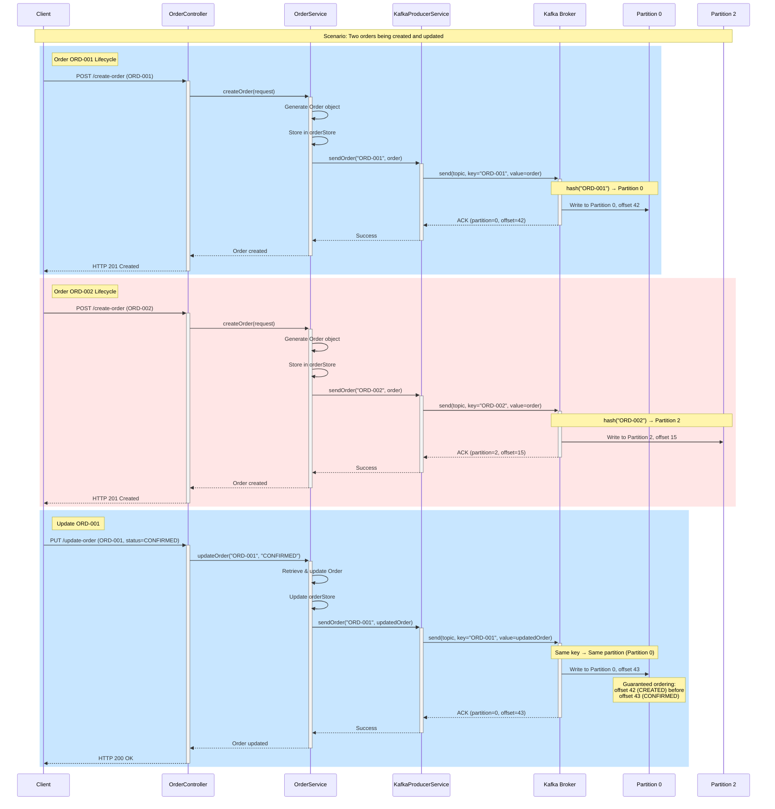

# Producer Module – Project Structure

## System Overview

The **Producer (Cart Service)** is responsible for publishing order events to Kafka topics. It implements key Kafka patterns to ensure reliable, ordered message delivery as required by Exercise 2 of the MTA Event-Driven Architecture course.

### Key Design Principles
- **Message Keying**: Uses `orderId` as the Kafka message key to guarantee partition-level ordering
- **At-Least-Once Delivery**: Configured with `acks=all` and idempotence for maximum reliability
- **Resilience**: Implements Circuit Breaker pattern and health monitoring for broker connectivity
- **Asynchronous Callbacks**: Uses KafkaTemplate with synchronous blocking for response accuracy

---

## System Flow

### Producer Event Flow

The Cart Service exposes two primary REST endpoints that publish order events to Kafka:

#### 1. POST /cart-service/create-order
**Purpose**: Create a new order and publish to Kafka

**Flow**:
```
1. Client sends POST /cart-service/create-order with order details
   ↓
2. OrderController receives CreateOrderRequest
   ↓
3. Request validation (@Valid annotations)
   ↓
4. OrderService.createOrder() generates Order object with unique orderId
   ↓
5. Order stored in local orderStore (in-memory map)
   ↓
6. KafkaProducerService.sendOrder(orderId, order)
   ├─ Circuit Breaker checks failure rate
   ├─ KafkaTemplate.send(topic, orderId, order) ← orderId is MESSAGE KEY
   ├─ .get(10s) blocks waiting for Kafka acknowledgment
   ├─ Kafka internally retries with exponential backoff (up to 12 retries)
   ↓
7a. SUCCESS Path:
   ├─ Kafka ACK received (all replicas acknowledged)
   ├─ Log success with partition and offset
   └─ Return HTTP 201 Created to client
   
7b. FAILURE Path:
   ├─ Timeout or Kafka unreachable
   ├─ Log failed order to failed-orders.log
   ├─ Rollback: Remove order from local orderStore
   ├─ Throw ServiceUnavailableException
   └─ Return HTTP 500 or 503 to client
```

#### 2. PUT /cart-service/update-order
**Purpose**: Update an existing order status and publish update event to Kafka

**Flow**:
```
1. Client sends PUT /cart-service/update-order with orderId and new status
   ↓
2. OrderController receives UpdateOrderRequest
   ↓
3. Request validation (@Valid annotations)
   ↓
4. OrderService.updateOrder(orderId, newStatus)
   ├─ Retrieve existing order from local orderStore
   ├─ If not found: throw OrderNotFoundException (404)
   ├─ Clone order with new status
   ├─ Store previous version for potential rollback
   ↓
5. Update local orderStore with new status
   ↓
6. KafkaProducerService.sendOrder(orderId, updatedOrder)
   ├─ Same flow as create-order (Circuit Breaker → Kafka send)
   ├─ Uses SAME orderId as message key (maintains partition affinity)
   ↓
7a. SUCCESS Path:
   ├─ Kafka ACK received
   └─ Return HTTP 200 OK to client
   
7b. FAILURE Path:
   ├─ Rollback: Restore previous order version in orderStore
   ├─ Log failed order to failed-orders.log
   └─ Return HTTP 500 or 503 to client
```

---

### Message Key Strategy: Ensuring Strict Ordering

**Critical Requirement**: Updates for any specific order must be processed in the **correct sequence**.

**Implementation**:
```
Message Key = orderId (e.g., "ORD-1A2B")
   ↓
Kafka Partitioning: partition = hash(orderId) % num_partitions
   ↓
Result: All events for SAME orderId → SAME partition
   ↓
Guarantee: Kafka maintains strict ordering within a partition
```

**Example Scenario**:
```
Order ORD-001:
  Event 1: status=CREATED  → Key=ORD-001 → hash → Partition 0
  Event 2: status=CONFIRMED → Key=ORD-001 → hash → Partition 0
  Event 3: status=DISPATCHED → Key=ORD-001 → hash → Partition 0
  
Order ORD-002:
  Event 1: status=CREATED  → Key=ORD-002 → hash → Partition 2
  Event 2: status=CONFIRMED → Key=ORD-002 → hash → Partition 2
```

**Why This Works**:
- Kafka's partitioning algorithm is deterministic: same key always maps to same partition
- Within a partition, message order is strictly maintained (FIFO)
- Consumers reading from a partition receive messages in the exact order they were written
- Different orders can be processed in parallel across different partitions (scalability)

---

## System Architecture Diagram

```mermaid
flowchart TD
    Client[Client Application]
    
    subgraph Producer["Cart Service (Producer)"]
        API[OrderController<br/>REST API]
        Service[OrderService<br/>Business Logic]
        KafkaSvc[KafkaProducerService<br/>Message Publishing]
        CB[Circuit Breaker<br/>Resilience4j]
        Store[In-Memory Store<br/>orderStore Map]
    end
    
    subgraph Kafka["Apache Kafka Cluster"]
        Topic[Topic: order-events<br/>Partitions: 3]
        P0[Partition 0]
        P1[Partition 1]
        P2[Partition 2]
    end
    
    Client -->|POST /create-order| API
    Client -->|PUT /update-order| API
    API --> Service
    Service --> Store
    Service --> KafkaSvc
    KafkaSvc --> CB
    CB -->|send(orderId, order)| Topic
    Topic -->|hash(orderId) % 3| P0
    Topic --> P1
    Topic --> P2
    
    style API fill:#e1f5ff
    style KafkaSvc fill:#ffe1e1
    style CB fill:#fff4e1
    style Topic fill:#e1ffe1
```

---

## Order Event Flow with Partitioning



**Key Observations**:
1. **ORD-001** events always go to **Partition 0** (deterministic hashing)
2. **ORD-002** events go to **Partition 2** (different partition)
3. Within Partition 0, offset 42 (CREATED) is guaranteed to be before offset 43 (CONFIRMED)
4. Consumers reading Partition 0 will receive events in the correct sequence
5. Different orders can be processed concurrently (different partitions)

---

## Asynchronous Callbacks and Blocking

The Producer uses a **synchronous blocking** approach with Kafka's asynchronous client:

```java
// KafkaProducerService.sendOrder()
SendResult<String, Order> result = kafkaTemplate.send(topicName, orderId, order)
    .get(10000, TimeUnit.MILLISECONDS);  // ← Blocks for up to 10 seconds
```

**Why Blocking?**
- **Response Accuracy**: Client receives definitive success/failure response
- **No Ghost Successes**: If client receives 500 error, order is guaranteed not in Kafka
- **State Consistency**: Local orderStore can be rolled back on failure
- **Circuit Breaker**: Failures feed into Circuit Breaker to open circuit when broker is down

**Kafka Internal Retry Flow** (asynchronous under the hood):
```
Application calls .send().get(10s)
   ↓
Kafka Producer Client attempts send
   ├─ Attempt 1: Immediate
   ├─ Retry 1: +100ms (if failed)
   ├─ Retry 2: +200ms (exponential backoff)
   ├─ Retry 3: +400ms
   ├─ ... up to 12 retries
   ├─ Total window: 120s (delivery.timeout.ms)
   └─ Application timeout: 10s (ensures no ghost successes)
   ↓
Result: Success (ACK) or Exception (Timeout/Failure)
```

**Trade-offs**:
- ✅ Guarantees client knows the outcome (200/500/503)
- ✅ Prevents "lost orders" in limbo state
- ✅ Enables proper rollback of local state
- ❌ API latency includes Kafka round-trip time (~5-50ms normally, up to 10s on timeout)

---

## Directory Layout

```text
producer/
├── pom.xml
├── Dockerfile
├── docker-compose.yml
├── generated-requests.http              # HTTP request templates for manual testing
├── src/main/
│   ├── java/mta/eda/producer/
│   │   ├── Producer.java                      # Spring Boot entry point
│   │   ├── controller/
│   │   │   └── OrderController.java           # REST endpoints (root, health, orders)
│   │   ├── service/
│   │   │   ├── kafka/
│   │   │   │   ├── KafkaProducerService.java  # Kafka publishing layer (sync)
│   │   │   │   └── KafkaHealthService.java    # Kafka connectivity health checks
│   │   │   ├── order/
│   │   │   │   └── OrderService.java          # Business logic & coordination
│   │   │   └── utils/
│   │   │       └── OrderUtils.java            # Order generation utilities
│   │   ├── model/
│   │   │   ├── Order.java                     # Full order domain model (Kafka payload)
│   │   │   ├── OrderItem.java                 # Order line item
│   │   │   ├── CreateOrderRequest.java        # POST /create-order DTO
│   │   │   └── UpdateOrderRequest.java        # PUT /update-order DTO
│   │   ├── config/
│   │   │   ├── KafkaProducerConfig.java       # Kafka producer configuration
│   │   │   └── KafkaTopicConfig.java          # Topic auto-creation (NewTopic bean)
│   │   └── exception/
│   │       ├── GlobalExceptionHandler.java    # Centralized error handling
│   │       ├── ProducerSendException.java     # Kafka send failure exception
│   │       ├── DuplicateOrderException.java   # Duplicate orderId exception
│   │       ├── OrderNotFoundException.java    # Order not found exception
│   │       ├── InvalidOrderIdException.java   # Invalid orderId format exception
│   │       └── README.md                      # Error handling documentation
│   └── resources/
│       └── application.properties             # Kafka + app config + logging
└── docs/
    ├── planing.md                             # Implementation plan
    └── STRUCTURE.md                           # This file
```

## Component Overview

### Controllers
- **OrderController**: REST API endpoints for health checks and order operations

### Services
- **KafkaProducerService**: Synchronous Kafka message publishing with error handling
- **KafkaConnectivityService**: Background monitoring of Kafka broker and topic availability with exponential backoff retry
- **KafkaHealthService**: Kafka connectivity and topic existence checks for health endpoints
- **OrderService**: Business logic for order creation/update and ID normalization

### Models
- **Order**: Full order payload published to Kafka
- **OrderItem**: Line item within an order
- **CreateOrderRequest**: DTO for POST /create-order
- **UpdateOrderRequest**: DTO for PUT /update-order

### Configuration
- **KafkaProducerConfig**: Kafka producer settings (acks=all, idempotence, etc.)
- **KafkaTopicConfig**: Defines NewTopic bean that auto-creates the 'orders' topic on application startup if it doesn't exist

### Exception Handling
- **GlobalExceptionHandler**: Centralized exception handling for all endpoints
- **ProducerSendException**: Kafka send failures (TIMEOUT, INTERRUPTED, KAFKA_ERROR)
- **DuplicateOrderException**: Order already exists (409 Conflict)
- **OrderNotFoundException**: Order not found (404 Not Found)
- **InvalidOrderIdException**: Invalid orderId format (400 Bad Request)

## Key Files

### Configuration
- `application.properties`: All Kafka, logging, and application settings
- `pom.xml`: Maven dependencies and build configuration

### Testing
- `generated-requests.http`: Manual HTTP testing templates

### Deployment
- `Dockerfile`: Multi-stage Docker build
- `docker-compose.yml`: Full stack (Zookeeper + Kafka + Producer)

### Documentation
- `planing.md`: Complete implementation plan
- `STRUCTURE.md`: This project structure reference

